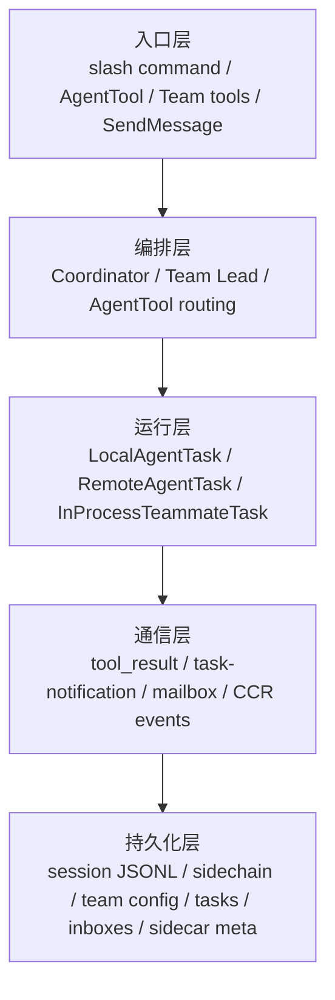
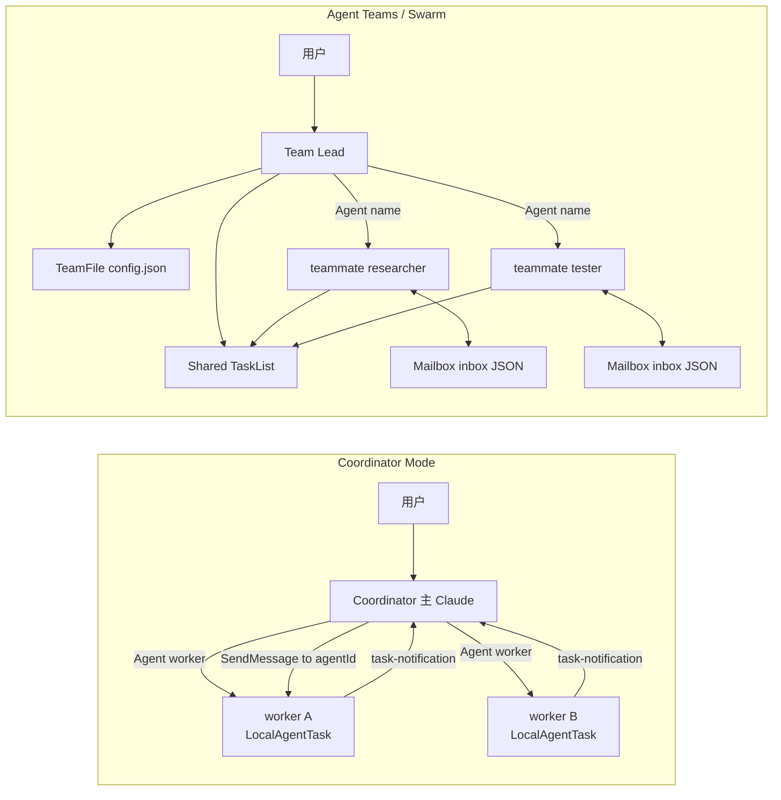
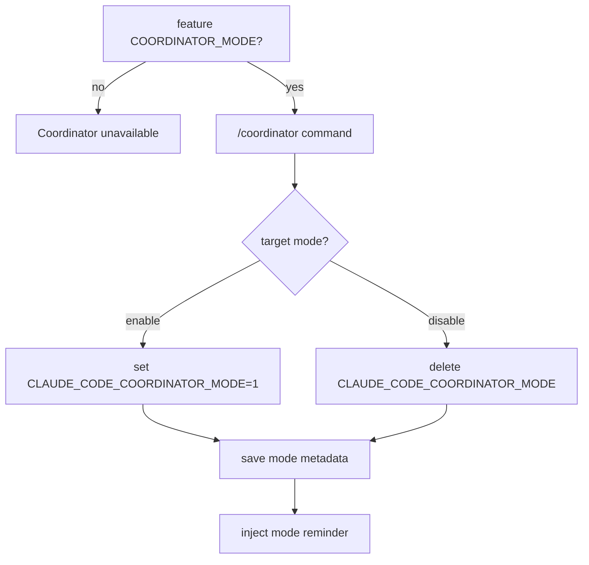
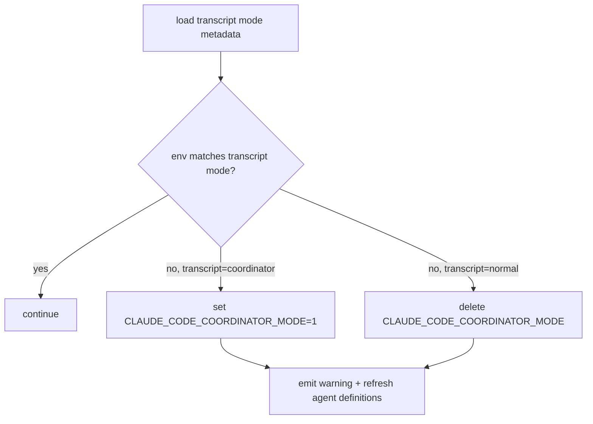
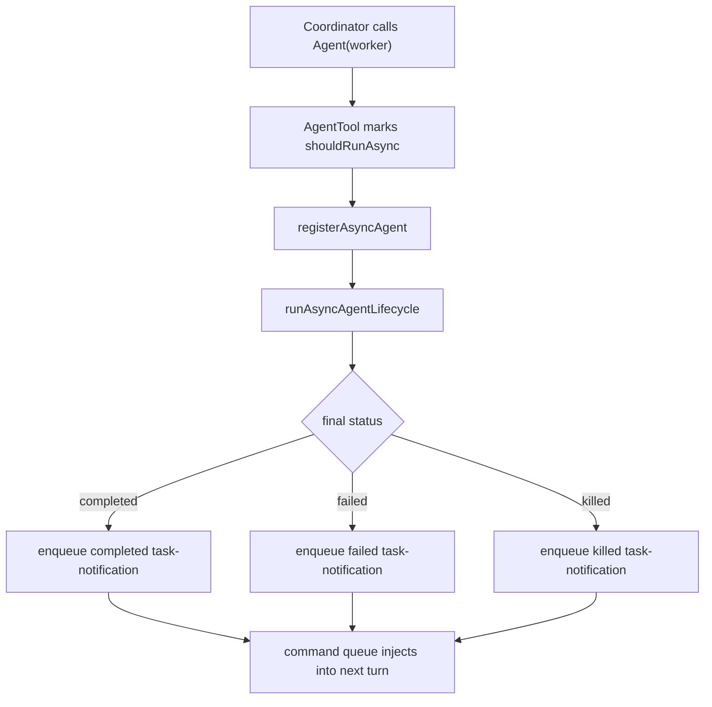
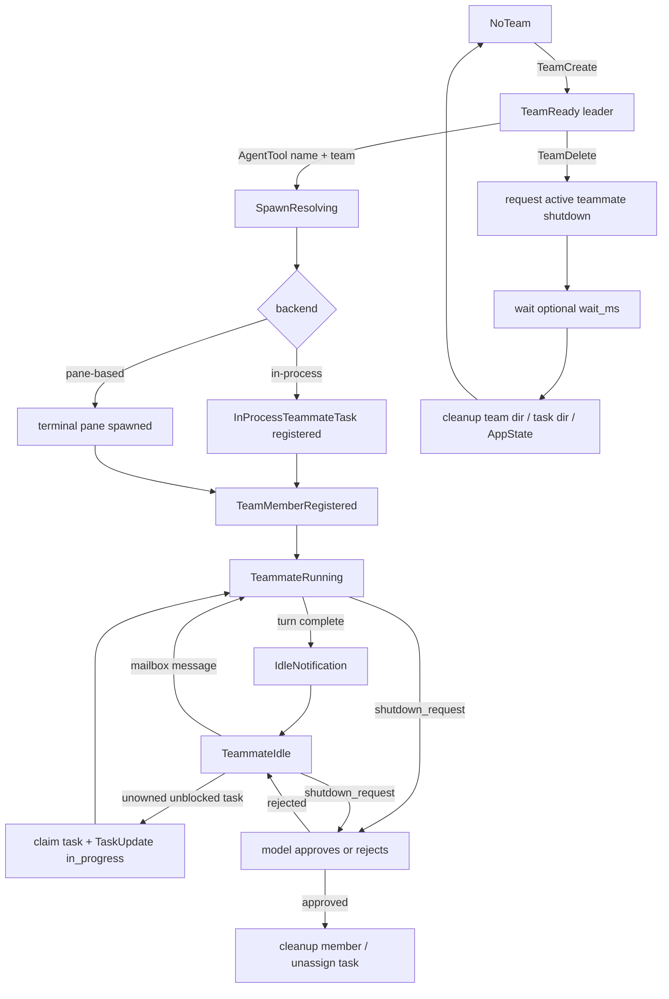
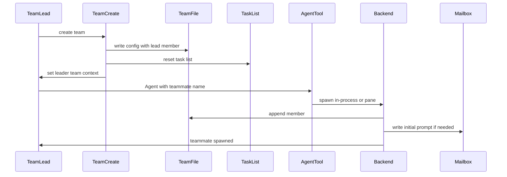
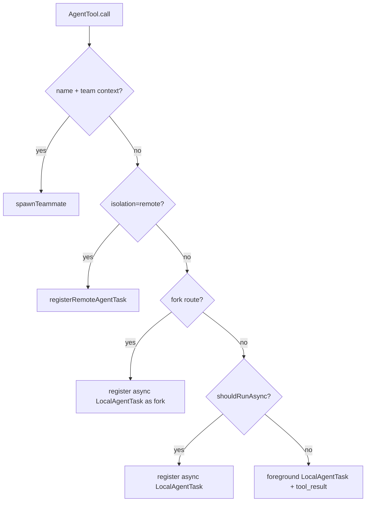
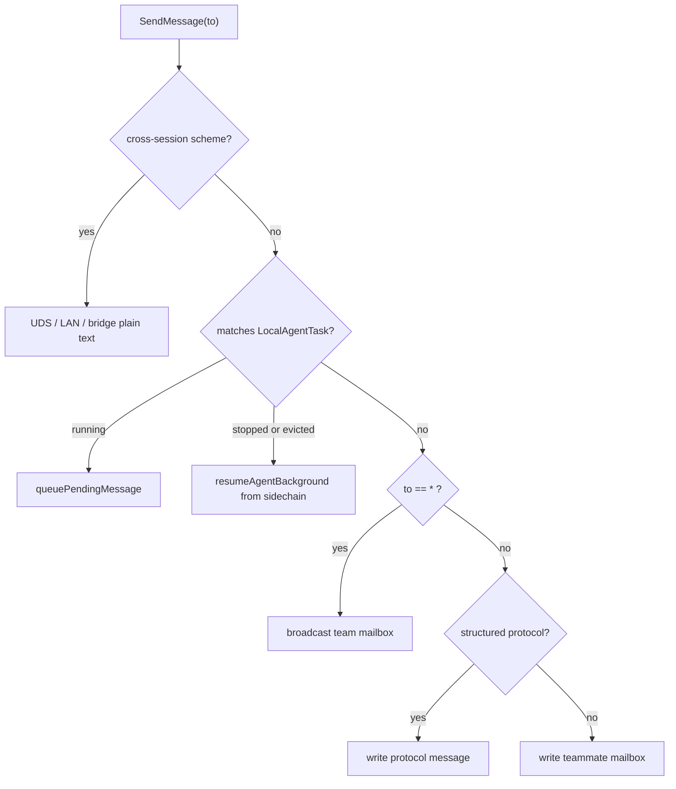
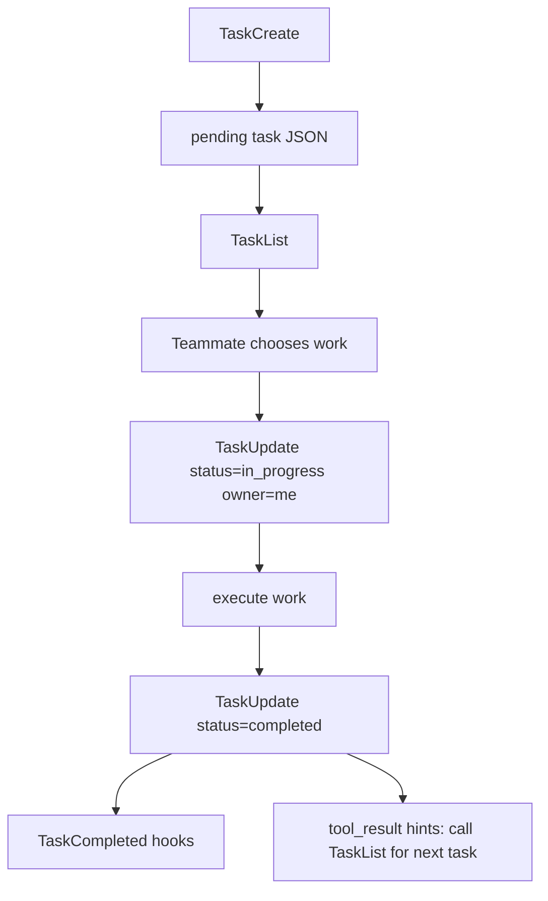

Claude Code 里有很多看起来都叫“多 Agent”的东西：`Agent` 工具、fork agent、Coordinator Mode、Agent Teams / Swarm、remote agent、后台 runtime task、`TaskCreate` 任务白板。它们共享部分底层设施，但不是同一个抽象。

这篇文档解决的是跨机制理解问题：当你看到一个任务被“派出去”、一个 teammate 变成 idle、一个 `<task-notification>` 回到主线程、一个 team 目录还在但 teammate 不跑了，应该知道它属于哪套机制、状态放在哪里、通信走哪条路、哪些东西能恢复。

## 全局心智模型

最短心智模型是：

```text
Agent 是派人干活。
TaskCreate 是往白板上贴任务卡。
Runtime Task 是正在跑的人或远端人影。
Coordinator 是星型编排器。
Swarm 是有成员、有邮箱、有任务白板的团队。
```

先把几个词压平：

| 概念 | 本质 | 入口 | 状态位置 | 结果回路 |
|---|---|---|---|---|
| 普通 sync subagent | 一次性前台 `Agent` tool call | `Agent({ subagent_type })` | foreground `LocalAgentTask` | 当前 turn 的 `tool_result` |
| 普通 async subagent | 一次性后台 agent | `Agent({ subagent_type, async: true })` 或自动后台化 | `AppState.tasks` + sidechain | `async_launched` + `<task-notification>` |
| fork agent | 继承父上下文和 exact tools 的后台分支 | 省略 `subagent_type` 且 fork gate 满足 | `LocalAgentTask` + `.meta.json` | `<task-notification>` |
| coordinator worker | Coordinator 派出的 `worker` async subagent | Coordinator 调 `Agent({ subagent_type: "worker" })` | `LocalAgentTask` | `<task-notification>` + `SendMessage(to: agentId)` |
| swarm teammate | 长生命周期团队成员 | `Agent({ name, team_name?, prompt })` | `InProcessTeammateTask` 或 pane member | mailbox by name，可 idle 后继续 |
| remote agent | 远端执行体的本地镜像 | `Agent(..., isolation: "remote")` | `RemoteAgentTask` + remote sidecar | CCR events / polling |
| work item task | 共享任务白板条目 | `TaskCreate/Update/List/Get` | `~/.claude/tasks/<taskListId>/*.json` | teammate / lead 认领和更新 |
| runtime task | 正在运行或曾运行的后台执行体 | agent、shell、workflow、remote 等入口 | `AppState.tasks` | UI、spinner、resume、kill |

## 系统分层

多 Agent 系统可以看成五层，每层回答一个问题：

| 层 | 回答的问题 | 典型对象 |
|---|---|---|
| 入口层 | 用户或模型通过什么工具启动动作 | `/coordinator`、`AgentTool`、`TeamCreate`、`SendMessage`、`TaskUpdate` |
| 编排层 | 谁负责拆解、派发、控制和综合 | Coordinator、Team Lead、AgentTool routing |
| 运行层 | 谁真正执行或代表执行状态 | `LocalAgentTask`、`InProcessTeammateTask`、`RemoteAgentTask` |
| 通信层 | 结果和控制信号如何回流 | `tool_result`、`<task-notification>`、mailbox、CCR events |
| 持久化层 | 进程重启后还能看见什么 | session JSONL、sidechain、team config、task files、inbox、sidecar meta |



这五层不是一一对应关系。Coordinator worker 在运行层是 `LocalAgentTask`，通信层靠 `<task-notification>` 和 `SendMessage(to: agentId)`；Swarm teammate 在运行层可能是 `InProcessTeammateTask`，通信层靠 mailbox；remote agent 在运行层是本地 `RemoteAgentTask` 镜像，真实执行状态来自 CCR。

## 什么时候用哪套机制

| 场景 | 推荐机制 | 为什么 |
|---|---|---|
| 需要一个主脑拆解、派发、综合、纠偏 | Coordinator Mode | 主线程被限制为编排器，减少直接上手乱改。 |
| 多个任务相对独立，需要长期队友持续领任务 | Agent Teams / Swarm | 有 team config、mailbox、shared task list。 |
| 只想派一个专家研究或修改 | 普通 subagent | 成本低、模型路径短、结果直接回当前 turn 或后台通知。 |
| 想复制当前上下文做并行探索 | fork agent | 继承父上下文和 exact tools，适合分支探索。 |
| 想把工作放到远端环境执行 | remote agent | 本地只保留 `RemoteAgentTask` 镜像，执行在 CCR。 |

两个常见误判：

| 误判 | 更好的选择 |
|---|---|
| “我要并行，所以一定用 Swarm” | 如果只是一次性研究/验证，用 async subagent 或 Coordinator worker 更轻。 |
| “我要团队，所以 Coordinator 就够了” | 如果需要成员持续认领共享任务、互相发消息、保留 team 状态，用 Swarm。 |

## 两种多 Agent 拓扑

Coordinator 和 Swarm 都是多 Agent，但控制权和状态模型完全不同。



| 维度 | Coordinator Mode | Agent Teams / Swarm |
|---|---|---|
| 拓扑 | 星型：Coordinator 居中，worker 外围 | 团队型：Team Lead + named teammates + mailbox + task list |
| 主 Claude 角色 | 只编排，不直接执行 | 可以直接执行，也可以作为 team lead 管理团队 |
| 执行者 | built-in `worker` async subagent | teammate，可能是 in-process，也可能是 pane-based |
| 通信方式 | `<task-notification>`，必要时 `SendMessage(to: agentId)` | mailbox by name，支持 P2P、broadcast、structured protocol |
| 任务协作 | 不以 `TeamCreate/TaskList` 为核心 | `TeamFile` + shared task list + mailbox |
| 恢复模型 | mode 在主 transcript，worker 是 local agent sidechain | team/task/inbox 文件可保留；in-process runner 不完整恢复 |

Coordinator Mode 不是 Swarm 的特殊 Team Lead。它共享 `AgentTool`、`LocalAgentTask`、`SendMessage` 等设施，但不使用 `TeamCreate/TeamDelete/TaskList/TaskUpdate` 作为核心团队协作机制。

## Coordinator Mode 五段状态机

Coordinator Mode 的核心设计是把主 Claude 降级为编排器：主线程不直接 `Read/Edit/Bash`，而是拆任务、派 worker、综合结果、必要时停止或继续 worker。

### 1. 启用状态机



两层条件都满足才算进入 Coordinator：

| 条件 | 作用 |
|---|---|
| `feature("COORDINATOR_MODE")` | 构建/运行 feature gate。 |
| `CLAUDE_CODE_COORDINATOR_MODE=1` | 当前进程实际进入 coordinator。 |

### 2. 恢复状态机

Coordinator mode 是会话属性，写在主 session JSONL 的 `mode` entry 中：

```jsonl
{"type":"mode","sessionId":"...","mode":"coordinator"}
```

resume 时会把当前环境和 transcript 中的 mode 对齐：



这避免用户在 normal 环境恢复 coordinator 会话，或反过来把普通会话误当 coordinator 运行。

### 3. Prompt 状态机

Coordinator prompt 不是只看 env。交互 REPL 侧大致优先级是：

| 优先级 | 来源 | 说明 |
|---|---|---|
| 1 | override system prompt | 最高优先级。 |
| 2 | coordinator prompt | `isCoordinatorMode()` 且没有 `mainThreadAgentDefinition` 时使用。 |
| 3 | main-thread agent prompt | `--agent` / settings agent。 |
| 4 | custom/default prompt | 普通主线程 prompt。 |
| 5 | append prompt | 追加型补充。 |

风险点是 `--agent` 和 Coordinator 混用：可能出现工具池已经按 coordinator 过滤，但 system prompt 不是 coordinator 的不一致。

Headless 也要单独看。当前 headless 路径明确做了 coordinator 工具过滤，并注入 coordinator user context；但 system prompt 组装路径和交互 REPL 不完全相同，应把它当成需要复核的边界，而不是默认等同交互路径。

### 4. 工具过滤状态机

Coordinator 主线程和 worker 的工具池不同：

| 角色 | 工具池 | 设计目的 |
|---|---|---|
| Coordinator 主线程 | `Agent`、`SendMessage`、`TaskStop`、`SyntheticOutput`、PR activity 订阅类 MCP 工具 | 只编排，不直接执行。 |
| worker | `ASYNC_AGENT_ALLOWED_TOOLS`，排除 `TeamCreate`、`TeamDelete`、`SendMessage`、`SyntheticOutput` | 执行任务，但不能继续嵌套编排。 |
| simple mode worker | `Bash`、`Read`、`Edit` | 降低工具面，适合简单执行路径。 |
| MCP 工具 | 按已连接 server 注入 worker context | 让 worker 能使用外部能力，但由工具池控制边界。 |
| scratchpad | gate 开启时提供 scratchpad 目录 | 允许跨 worker 共享临时知识。 |

交互路径主要走 `mergeAndFilterTools()`；headless 路径会在主入口直接应用 coordinator 工具过滤；worker 工具池由 `AgentTool` 独立组装，不继承主线程被过滤后的工具池。

### 5. Worker lifecycle

Coordinator 下 `Agent(worker)` 会被强制异步：



`<task-notification>` 是 user-role message，但不是用户输入。Coordinator prompt 必须把它当成 worker 结果信号：

```xml
<task-notification>
  <task-id>agent-a1b</task-id>
  <status>completed|failed|killed</status>
  <summary>Agent "Investigate auth bug" completed</summary>
  <result>Found null pointer in src/auth/validate.ts:42...</result>
  <usage>
    <total_tokens>N</total_tokens>
    <tool_uses>N</tool_uses>
    <duration_ms>N</duration_ms>
  </usage>
</task-notification>
```

Coordinator 的关键约束是“综合而不是转发”。worker 看不到用户和 coordinator 的完整对话，所以 prompt 必须自包含：

```text
Fix the null pointer in src/auth/validate.ts:42.
Session.user can be undefined when the session expires but the token remains cached.
Add a null check before user.id access; if null, return 401 with "Session expired".
Run validate.test.ts and report the commit hash.
```

反模式是：

```text
Based on your findings, fix it.
```

### Coordinator 边界与排错

| 现象 | 可能原因 | 处理方式 |
|---|---|---|
| Coordinator 主线程不能读文件或跑命令 | 工具池被过滤，这是预期行为 | 派 `worker`，把文件、错误、验收标准写入 worker prompt。 |
| `--agent` 后 coordinator 行为不一致 | agent prompt 优先级压过 coordinator prompt，但工具仍可能被过滤 | 避免混用，或确认当前 system prompt 来源。 |
| worker 还在跑但方向错 | runtime task 仍是 `running` | 用 `TaskStop` 停止；会产生 `killed` notification。 |
| worker 完成但结论不够 | 已经结束的一次性 async agent | 更推荐 fresh worker；只有需要保留 sidechain 时才 `SendMessage` 续跑。 |
| `SendMessage` 失败 | 找不到 agent、缺 sidechain transcript、message 缺 `summary` | 查 agentId/name、sidechain `.jsonl/.meta.json`，plain text message 记得带 `summary`。 |
| coordinator 下没有 `worker` | non-interactive 下禁用了 built-in agents | 检查 `CLAUDE_AGENT_SDK_DISABLE_BUILTIN_AGENTS`。 |

## Swarm 完整状态机

Swarm 的核心是团队，而不是一次 `Agent` 调用。`TeamCreate` 建 team，`Agent({ name })` 加 teammate，`TaskCreate/Update/List/Get` 提供任务白板，`SendMessage` 和 mailbox 提供通信与控制。

当前实现默认启用 Agent Teams；设置 `CLAUDE_CODE_EXPERIMENTAL_AGENT_TEAMS_DISABLED` 才会关闭。

### 团队生命周期



关键不变量：

| 不变量 | 含义 |
|---|---|
| roster 扁平 | teammate 内禁止再 spawn teammate，避免团队嵌套。 |
| mailbox 按 name 寻址 | inbox 路径是 `teamName + agentName`，不是 agentId。 |
| task list 是共享白板 | `TaskCreate` 只写 pending task，不启动执行体。 |
| shutdown 不是强杀 | shutdown request 会交给模型处理，approve 后才 graceful shutdown。 |
| TeamFile 是跨进程事实源 | `AppState.teamContext` 是 leader UI 的投影。 |

### 存储拓扑

Swarm 的核心状态在 `~/.claude/teams` 和 `~/.claude/tasks`：

```text
~/.claude/
  teams/
    <team-name>/
      config.json
      inboxes/
        <agent-name>.json
  tasks/
    <team-name>/
      .highwatermark
      1.json
      2.json
      ...
```

| 文件或结构 | 内容 |
|---|---|
| `TeamFile` | `name`、`leadAgentId`、`leadSessionId`、`hiddenPaneIds`、`teamAllowedPaths`、`members[]`。 |
| `TeamFile.members[]` | `agentId`、`name`、`agentType`、`model`、`color`、`backendType`、`isActive`、`mode`、`worktreePath`、`sessionId`。 |
| task JSON | `id`、`subject`、`description`、`activeForm`、`owner`、`status`、`blocks`、`blockedBy`、`metadata`。 |
| mailbox JSON | 普通消息、协议消息、已读状态、颜色和摘要等。 |

### TeamCreate 到 teammate 的链路



`TeamCreate` 不只是写 `config.json`。它还会注册 session cleanup、重置 team 对应 task list、设置 `leaderTeamName`，并把 leader 投影到 `AppState.teamContext`。

`AgentTool` 遇到 `team_name/current teamContext + name` 时走 teammate spawn 分支，不走普通 `runAgent()`。`spawnTeammate()` 会解析 team、唯一化 name、选择 backend、更新 `AppState.teamContext.teammates`，再追加 `TeamFile.members`。

### in-process vs pane-based teammate

| 维度 | in-process teammate | pane-based teammate |
|---|---|---|
| 运行位置 | leader 同进程 | 独立终端 pane / CLI 进程 |
| 启动方式 | 注册 `InProcessTeammateTask`，启动 `runInProcessTeammate()` | 创建 tmux / iTerm2 / Windows Terminal pane |
| 消息消费 | runner 自己约 500ms poll mailbox | leader / teammate 侧 `useInboxPoller()` 约 1s poll |
| 输入路径 | teammate view 输入进入 `pendingUserMessages` | 普通 mailbox prompt 进入 teammate 进程 |
| 处理优先级 | shutdown > team-lead message > peer message > unowned task claim | poller 按消息类型路由，空闲时自动开一轮 |
| UI | spinner tree、footer pills、detail dialog、teammate transcript view | footer TeamStatus、TeamsDialog、pane 状态 |
| 恢复 | runner、AbortController、pending queue 在内存，进程重启不能完整恢复 | pane 进程可能还在；leader 侧 backend map 不持久化，恢复是 best-effort |
| 删除 | 需要当前 AppState task / AbortController | 通过 backend 写 shutdown request，等待 teammate approve / cleanup |

## AgentTool 分流决策树

`AgentTool.call()` 是多 Agent 入口最复杂的分叉点。同一个 `Agent` 工具会根据参数和上下文走不同运行时：



| 路由 | 触发条件 | 结果 |
|---|---|---|
| teammate | 有 `name`，且存在 `team_name` 或当前 `teamContext` | `spawnTeammate()`，返回 `teammate_spawned`。 |
| remote | `isolation: "remote"` | 注册 `RemoteAgentTask`，本地保存 remote sidecar。 |
| fork | 省略 `subagent_type` 且 fork gate/上下文允许 | 强制后台 local agent，继承父上下文和 exact tools。 |
| async local | 显式 async、Coordinator worker、或自动后台条件满足 | 返回 `async_launched`，完成后注入 `<task-notification>`。 |
| sync local | 默认前台一次性 subagent | 当前 tool call 返回 `tool_result`。 |

所以文档里不能把“Agent”写成一个单一概念：同一个工具入口下面至少有五条运行路径。

## 通信路径对照

多 Agent 的通信路径决定了结果是否进入当前 turn、是否持久化、能不能 resume。

| 通信路径 | 发送者 | 接收者 | 用途 | 持久化/恢复 |
|---|---|---|---|---|
| `tool_result` | sync subagent | 当前 assistant turn | 一次性前台结果 | 写入主 transcript。 |
| `<task-notification>` | async local agent / coordinator worker | 主线程下一 turn | 后台完成/失败/被杀通知 | 来自 `LocalAgentTask` lifecycle 和 sidechain。 |
| `SendMessage(to: agentId)` | Coordinator 或用户 | local agent task | 继续 running/stopped worker | running 时排队；stopped 时尝试 sidechain resume。 |
| `SendMessage(to: teammateName)` | lead / teammate | teammate mailbox | Swarm 普通通信 | 写 inbox JSON，按 name 寻址。 |
| `SendMessage(to: "*")` | lead / teammate | team members | Swarm broadcast | 写多个 inbox；structured message 不能 broadcast。 |
| structured mailbox protocol | lead / teammate / runtime | 特定 teammate 或 lead | permission、plan、shutdown、mode、task assignment | 保持 unread 给 poller 路由，不应被普通 attachment 吞掉。 |
| CCR events / polling | remote runtime | `RemoteAgentTask` | remote agent 状态和结果 | 本地 sidecar + 远端 session 状态。 |

### SendMessage 路由



plain text `SendMessage` 要带 `summary`。structured message 不能 broadcast，也不能跨 `uds/bridge/tcp` session。单 session 下 teammate name 是裸 name，`to` 不应写成含 `@` 的跨域地址。

## Mailbox 协议表

Mailbox 路径是：

```text
~/.claude/teams/<team-name>/inboxes/<agent-name>.json
```

它有 lock、原子 rename、大小上限和压缩策略：

| 限制 | 值 |
|---|---|
| 单条 text | 64KB |
| mailbox 文件 | 4MB |
| retained bytes | 2MB |
| 普通 message 保留 | 最多 1000 条 |
| read message 保留 | 最多 200 条 |
| unread protocol message 保留 | 最多 2000 条 |

协议消息不只是“聊天”：

| 消息类型 | 典型发送者 | 典型接收者 | 消费者 | 是否应进入普通 LLM context |
|---|---|---|---|---|
| plain text | lead / teammate | teammate / lead | mailbox attachment 或 prompt handler | 是 |
| broadcast | lead / teammate | team members | mailbox attachment 或 prompt handler | 是 |
| `task_assignment` | `TaskUpdate` | new owner | teammate poller / runner | 通常作为任务触发，不应当成普通闲聊 |
| `permission_request/response` | teammate / lead | lead / teammate | `useInboxPoller` + permission UI queue | 否 |
| `sandbox_permission_request/response` | teammate / sandbox host | lead / teammate | permission sync | 否 |
| `plan_approval_request/response` | teammate / lead | lead / teammate | plan approval path | 否 |
| `shutdown_request/approved/rejected` | lead / teammate | teammate / lead | backend / runner / poller | 否 |
| `mode_set_request` | lead | teammate | permission mode sync | 否 |
| `team_permission_update` | lead | team members | permission sync | 否 |
| idle notification | teammate runner | lead | UI / lead poller | 通常否 |

一个重要边界：mailbox attachment 只消费非结构化消息；结构化协议消息应保持 unread，交给 `useInboxPoller` 或 in-process runner 路由。否则权限、plan、shutdown 可能被当成普通上下文吞掉。

## Task 不是 Runtime Task

`TaskCreate` 的 task 和 `LocalAgentTask` 的 task 是两套模型。

| 名称 | 源码类型 | 存储 | 状态 | 谁消费 |
|---|---|---|---|---|
| work item task | `src/utils/tasks.ts` 的 `Task` | `~/.claude/tasks/<taskListId>/<id>.json` | `pending/in_progress/completed` | Task tools、TaskList UI、teammate 认领 |
| runtime task | `TaskStateBase` 子类型 | `AppState.tasks`，部分有 sidecar/output | `running/completed/failed/killed` 等 | UI、spinner、background selector、kill/resume |

共享任务生命周期：



`TaskUpdate` 在 Swarm 下有增强：

| 行为 | 说明 |
|---|---|
| teammate 标记 `in_progress` 且 owner 为空 | 自动把 owner 设为当前 teammate name。 |
| owner 变化 | 写 `task_assignment` 到新 owner mailbox。 |
| status -> `completed` | 执行 TaskCompleted hooks。 |
| teammate 完成任务 | tool result 追加提示：立刻 `TaskList` 找下一项。 |
| 主线程完成 3+ 任务且没有 verification | 在 feature gate 下追加 verification nudge。 |

runtime task 类型包括：

| 类型 | 运行位置 | 典型场景 |
|---|---|---|
| `LocalAgentTask` | 本地子 agent | 普通后台 agent、fork、coordinator worker。 |
| `InProcessTeammateTask` | 同进程 runner | in-process teammate。 |
| `RemoteAgentTask` | CCR remote session | remote agent。 |
| `LocalShellTask` | 本地 shell | 后台 shell。 |
| `LocalWorkflowTask` | 本地 workflow | workflow 编排。 |
| `DreamTask` | 后台静默 | memory dream。 |
| `MonitorMcpTask` | 本地监控 | MCP monitor。 |

## 持久化与恢复矩阵

恢复能力取决于状态放在哪里。最重要的区别是：能看到状态不等于能继续运行。

| 机制 | 持久化 | resume 后能看到 | resume 后能继续跑 | 边界 |
|---|---|---|---|---|
| main session | 主 session JSONL | 对话链、metadata、mode | 是，按主会话恢复 | 受 compact/branch/leaf 影响。 |
| coordinator mode | 主 session JSONL 的 `mode` entry | 当前会话模式 | 是，`matchSessionMode()` 会切 env | prompt/tool 状态仍受当前启动参数影响。 |
| coordinator worker | local agent sidechain + `.meta.json` | agent task 身份和历史 | 通常可 `resumeAgentBackground()` | 缺 sidechain/meta 或工具定义变化会失败。 |
| ordinary/fork subagent | local agent sidechain + `.meta.json` | agent 历史 | 可恢复，fork 依赖 `agentType:"fork"` | fork 恢复需要 metadata 正确。 |
| remote agent | `remote-agents/remote-agent-<taskId>.meta.json` + CCR | remote task 镜像 | 取决于 CCR session 状态 | 404/archive 会删除 sidecar。 |
| team config | `~/.claude/teams/<team>/config.json` | team/member roster | 不代表 teammate runner 还活 | `TeamFile` 是事实源，`AppState` 是投影。 |
| mailbox | `~/.claude/teams/<team>/inboxes/*.json` | 未读普通/协议消息 | 可继续投递 | structured message 需要 poller/runner 正确消费。 |
| shared tasks | `~/.claude/tasks/<team>/*.json` | task list / owner / status | 可继续认领/更新 | owner 可能指向已经不活跃的 teammate。 |
| in-process teammate runner | leader 进程内存 | 不能完整看到 runner 内态 | 不能完整跨进程恢复 | AbortController、pending queue、recent messages 都在内存。 |
| pane-based teammate | 外部 pane + transcript + team file | 可能仍可见 | best-effort | leader 侧 backend map 不持久化，active/kill 依赖 pane 状态。 |

调试时可以按这个顺序问：

1. 文件还在吗？
2. `AppState` 投影还在吗？
3. runtime task 还在 `running` 吗？
4. 通信通道还可用吗？
5. sidechain / inbox / remote sidecar 是否足够恢复？

## 用户可见状态如何投影

UI 展示的是不同状态源的投影，不是单一真相。

| UI | 数据源 | 能说明什么 | 不能说明什么 |
|---|---|---|---|
| TaskListV2 | task files + `teamContext` | work item task、owner、状态 | owner 对应 teammate 一定还活。 |
| TeammateSpinnerTree | running in-process teammates | 当前 leader 进程内的 teammate 活动 | pane-based teammate 或历史 teammate 全部状态。 |
| TeammateSpinnerLine | `InProcessTeammateTaskState` | idle、approval、stopping、tool/token、最近消息 | 完整 transcript。 |
| BackgroundAgentSelector | backgrounded `LocalAgentTask` | 可选择的本地后台 agent | remote/shell/workflow/in-process teammate。 |
| agent transcript view | `viewingAgentTaskId` | local agent 或 in-process teammate 的可视化对话 | pane teammate 的完整外部进程状态。 |
| TeamsDialog / TeamStatus | `AppState.teamContext` + team file | 团队成员展示、管理、kill/shutdown/mode | runner 一定可恢复。 |

pane-based team 主要通过 footer TeamStatus 和 TeamsDialog 管理：Enter 查看，`k` kill，`s` shutdown，`p` prune idle，Shift+Tab 切 permission mode。in-process teammate 的 transcript view 输入会进 `pendingUserMessages`，不是写 mailbox。

## 两条端到端场景

### 复杂 bug 用 Coordinator

| 步骤 | 发生了什么 | 运行体 | 通信 | 持久化 |
|---|---|---|---|---|
| 1 | 用户提出复杂 bug | 主会话 | user message | main JSONL |
| 2 | Coordinator 拆成调查、实现、验证 | Coordinator 主线程 | `Agent(worker)` | main JSONL + task state |
| 3 | worker 异步执行 | `LocalAgentTask` | tool calls | sidechain JSONL |
| 4 | worker 完成 | `LocalAgentTask` | `<task-notification>` | notification queue / main turn |
| 5 | Coordinator 综合 root cause | 主线程 | assistant reasoning | main JSONL |
| 6 | 需要修正方向 | 同一个或新 worker | `SendMessage(to: agentId, summary, message)` 或 fresh `Agent` | sidechain / new sidechain |
| 7 | 汇总给用户 | 主线程 | assistant message | main JSONL |

这个流程没有 `TeamCreate`，也不依赖 shared task list。

### 长期并行任务用 Swarm

| 步骤 | 发生了什么 | 状态源 | 通信 |
|---|---|---|---|
| 1 | `TeamCreate({ team_name })` | `teams/<team>/config.json` + `tasks/<team>` | tool result |
| 2 | `TaskCreate` 多个工作项 | task JSON | Task tools |
| 3 | `Agent({ name: "researcher" })` | TeamFile member + backend task/pane | initial prompt |
| 4 | teammate 认领任务 | task JSON owner/status | `TaskUpdate` |
| 5 | lead 发消息 | inbox JSON | `SendMessage(to: teammateName)` |
| 6 | teammate 完成一轮 | runner/poller 状态 | idle notification |
| 7 | teammate 继续领任务 | task list | `TaskList` / claim |
| 8 | `TeamDelete({ wait_ms })` | team/task dirs cleanup | shutdown request / response |

这个流程里 team、task list 和 mailbox 是核心。teammate 输出不会自动给 lead；需要 `SendMessage` 或明确的协议消息。

## 失败与排障矩阵

| 现象 | 先查什么 | 常见原因 | 处理 |
|---|---|---|---|
| Coordinator worker 结果没回来 | `AppState.tasks[agentId]`、notification queue、sidechain | worker 仍 running、failed、被 killed、notification 尚未进入下一 turn | 等下一 turn；或看 sidechain / task status。 |
| `SendMessage(to: agentId)` 找不到 worker | agentId/name、sidechain `.jsonl/.meta.json` | agent 被 evict、metadata 缺失、传了 teammate name | 用正确 raw agentId；必要时新开 worker。 |
| `SendMessage(to: teammate)` 失败 | teamContext、team file、inbox path | teammate name 拼错、当前 session 无 team、用了含 `@` 地址 | 用当前 team 内裸 teammate name。 |
| plain text `SendMessage` 校验失败 | 参数 | 缺 `summary` | 补 `summary`。 |
| structured message 没生效 | inbox read 状态、poller | 被当普通 attachment 标 read，或 consumer 没跑 | 确认 structured message 保持 unread，poller/runner 活着。 |
| 任务不显示 | `leaderTeamName`、`getTaskListId()`、tasks dir | lead/teammate 指向不同 task list | 查 env/teamName/sessionId 优先级。 |
| task 被认领但没人执行 | task owner、team member active、runner/pane | owner teammate 不活跃或 runner 丢失 | 重新分配 owner，或重启 teammate。 |
| TeamDelete 拒绝清理 | `TeamFile.members[].isActive` | 仍有 active teammate | 先 graceful shutdown，或确认后手动清理。 |
| resume 后 team 在但 teammate 不跑 | team file、runner/pane 状态 | in-process runner 在旧进程内，不能恢复 | 重新 spawn teammate 或用现有 mailbox/task 重新编排。 |
| pane teammate 似乎还在但 UI 不准 | paneId、backendType、backend map | leader 侧 `spawnedTeammates` map 不持久化 | 以 TeamFile + pane 实际状态为准，best-effort 管理。 |
| permission/plan 卡住 | leader inbox、permission UI queue、protocol response | leader poller 没消费，或 response 没写回 | 查 `useInboxPoller` 和对应 inbox。 |
| remote agent resume 失败 | remote sidecar、CCR session | session 404 / archived | 接受 sidecar 清理，重新创建 remote agent。 |

## 常见误区

| 误区 | 正确理解 |
|---|---|
| Coordinator 就是 Swarm 的 Team Lead | 不是。Coordinator worker 是 async subagent，不是 teammate。 |
| Swarm 必须设置 `CLAUDE_CODE_EXPERIMENTAL_AGENT_TEAMS=1` | 当前实现默认启用；用 `CLAUDE_CODE_EXPERIMENTAL_AGENT_TEAMS_DISABLED` 关闭。 |
| `TaskCreate` 创建了一个运行中的 agent | 它只创建 work item JSON；运行体是 `LocalAgentTask` / `InProcessTeammateTask` 等。 |
| teammate 完成一轮后结果自动给 lead | 不一定。teammate 需要通过 `SendMessage` 沟通；runner 也会发送 idle notification。 |
| mailbox 按 agentId 寻址 | Swarm mailbox 按 teammate name 寻址。 |
| BackgroundAgentSelector 会列出所有后台任务 | 它只列 backgrounded `LocalAgentTask`，不列 remote/shell/workflow/in-process teammate。 |
| `TeamUpdate` 是一个工具 | 当前源码没有独立 `TeamUpdateTool`；团队成员更新分散在 spawn、teamHelpers、dialogs 中。 |
| `SyntheticOutput` 是 Swarm 内部通信工具 | 它主要用于结构化输出，不是 Team 协作核心。 |
| shutdown request 是强杀 | 不是，它是模型处理的 graceful shutdown 协议。 |
| in-process teammate 可以像 local agent 一样跨进程 resume | 不行，runner 运行态在内存中，进程重启后不能完整恢复。 |

## 延伸阅读

这篇文档是跨机制总览。需要深入某条链路时，优先看专题文档：

| 想深入 | 阅读 |
|---|---|
| `AgentTool` 参数、sync/async/fork、通知队列 | `docs/agent/sub-agents.mdx` |
| Task V2 数据模型、锁、高水位、owner、hooks | `docs/tools/task-management.mdx` |
| JSONL transcript、sidechain、compact、resume、remote sidecar | `docs/internals/session-transcript-persistence.md` |
| Coordinator feature 的单独说明 | `docs/features/coordinator-mode.md` |
| worktree 隔离 | `docs/agent/worktree-isolation.mdx` |

## 源码入口索引

| 问题 | 从这里看 |
|---|---|
| coordinator mode 检测、恢复、prompt、context | `src/coordinator/coordinatorMode.ts` |
| `/coordinator` 命令 | `src/commands/coordinator.ts` |
| coordinator worker 定义 | `src/coordinator/workerAgent.ts` |
| system prompt 选择 | `src/utils/systemPrompt.ts` |
| coordinator 工具过滤 | `src/utils/toolPool.ts` |
| coordinator mode 持久化 | `src/utils/sessionStorage.ts` 的 `mode` entry / `saveMode()` |
| AgentTool 路由 | `packages/builtin-tools/src/tools/AgentTool/AgentTool.tsx` |
| subagent query loop | `packages/builtin-tools/src/tools/AgentTool/runAgent.ts` |
| async local agent lifecycle | `packages/builtin-tools/src/tools/AgentTool/agentToolUtils.ts` |
| local agent runtime task | `src/tasks/LocalAgentTask/LocalAgentTask.tsx` |
| remote agent runtime task | `src/tasks/RemoteAgentTask/RemoteAgentTask.tsx` |
| agent resume | `packages/builtin-tools/src/tools/AgentTool/resumeAgent.ts` |
| task stop | `packages/builtin-tools/src/tools/TaskStopTool/TaskStopTool.ts`、`src/tasks/stopTask.ts` |
| team gate | `src/utils/agentSwarmsEnabled.ts` |
| team file helpers | `src/utils/swarm/teamHelpers.ts` |
| TeamCreate | `packages/builtin-tools/src/tools/TeamCreateTool/TeamCreateTool.ts` |
| TeamDelete | `packages/builtin-tools/src/tools/TeamDeleteTool/TeamDeleteTool.ts` |
| spawn teammate | `packages/builtin-tools/src/tools/shared/spawnMultiAgent.ts` |
| in-process teammate spawn | `src/utils/swarm/spawnInProcess.ts` |
| in-process teammate runner | `src/utils/swarm/inProcessRunner.ts` |
| pane backend | `src/utils/swarm/backends/PaneBackendExecutor.ts` |
| teammate AsyncLocalStorage identity | `src/utils/teammateContext.ts` |
| mailbox | `src/utils/teammateMailbox.ts` |
| permission sync | `src/utils/swarm/permissionSync.ts` |
| SendMessage routing | `packages/builtin-tools/src/tools/SendMessageTool/SendMessageTool.ts` |
| shared task list | `src/utils/tasks.ts` |
| Task tools | `packages/builtin-tools/src/tools/TaskCreateTool`、`TaskUpdateTool`、`TaskListTool`、`TaskGetTool` |
| inbox polling | `src/hooks/useInboxPoller.ts` |
| swarm initialization | `src/hooks/useSwarmInitialization.ts` |
| teammate view | `src/state/teammateViewHelpers.ts`、`src/screens/REPL.tsx` |
| teammate spinner | `src/components/Spinner/TeammateSpinnerTree.tsx`、`TeammateSpinnerLine.tsx` |
| team dialog/status | `src/components/teams/TeamsDialog.tsx`、`src/components/teams/TeamStatus.tsx` |
| background local agent selector | `src/hooks/useBackgroundAgentTasks.ts`、`src/components/tasks/BackgroundAgentSelector.tsx` |
