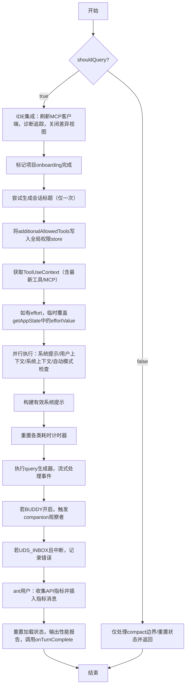

{/* 本章目标：从源码角度揭示会话编排、持久化存储、成本追踪和模型切换的完整链路 */}

首先要区分claude code的多种交互方式

REPL关注交互形态，SDK关注接入方式，ACP则关注通信协议。

### 🆚 核心概念对比

| 维度 | 🖥️ REPL (交互形态) | 🧩 SDK (接入方式) | 🌉 ACP (通信协议) |
| :--- | :--- | :--- | :--- |
| **是什么** | 供开发者直接在终端使用的**交互式对话环境** | 面向开发者的**程序化调用库**，供集成到其他应用 | 一种**开放式的通信标准**，连接不同AI Agent与编辑器 |
| **使用方式** | 1. 直接在终端输入`claude`命令<br>2. 进入专用界面（基于React Ink渲染）<br>3. 通过斜杠命令（如`/help`）交互 | 1. 在自己的Node.js/Python项目中安装SDK包（如`npm install claude-code-sdk`）<br>2. 通过API发送查询 | 1. 通过ACP适配器（如`claude-code-acp`）启动Claude Code<br>2. 供编辑器通过ACP协议与其通信 |
| **典型场景** | 开发者日常编写代码时，随时向其提问、修改代码或执行任务 | 将Claude Code的核心能力（对话、工具执行等）集成到自动化脚本、CI/CD流程或其他应用的后台中 | 将Claude Code的能力集成到JetBrains IDE、Zed等第三方编辑器中，利用其UI交互功能 |
| **主要特点** | - **面向人**：交互式、直观<br>- **功能完整**：可使用所有内置工具，并支持MCP集成<br>- **处理复杂任务**：可自主规划、执行多步操作 | - **面向程序**：编程化、可集成<br>- **轻量级**：不依赖Claude Code的完整运行时<br>- **由你控制**：适合在自有应用中实现自动化 | - **标准化**：统一不同Agent与编辑器间的通信<br>- **双向通信**：Agent可主动向编辑器请求文件、执行命令等<br>- **与编辑器深度整合**：能完全复用Claude Code的能力 |

其中的 🧩 SDK (接入方式) 与 🌉 ACP (通信协议)采用如下QueryEngine实现会话管理

作为一个对话终端（🖥️ REPL 交互形态模式），则使用的是 onQueryImpl 在 src/screens/REPL.tsx 中调用 query() 函数

对于REPL 交互形态模式的调用链路如下
```
用户输入  
  ↓  
onSubmit (REPL.tsx)  
  ↓  
handlePromptSubmit (handlePromptSubmit.ts)  
  ↓  
executeUserInput (handlePromptSubmit.ts)  
  ↓  
onQuery (REPL.tsx)  
  ↓  
onQueryImpl (REPL.tsx)  
  ↓  
query (query.ts) ← 在这里调用  
```

其中

query 函数是 Agentic Loop 的核心实现，包含 while(true) 循环处理对话回合 query.ts:460-522

onQueryImpl 是 REPL（Read-Eval-Print Loop）中与 AI 模型交互的核心控制器，它负责：

1.环境准备（IDE、诊断、权限）

2.会话标题的首次生成

3.构建动态系统提示和用户上下文

4.执行流式查询并实时更新 UI

5.收集性能指标和最终清理

##  `onQueryImpl` 方法的详细解析
以下是对 `onQueryImpl` 方法的详细解析。该方法是一个 React `useCallback` 包装的异步函数，负责处理用户消息到 AI 模型（Claude）的**完整查询流程**，包括预处理、系统提示构建、工具上下文准备、流式查询执行、后处理与指标记录。

---

### 一、函数签名与参数

```typescript
const onQueryImpl = useCallback(
  async (
    messagesIncludingNewMessages: MessageType[],
    newMessages: MessageType[],
    abortController: AbortController,
    shouldQuery: boolean,
    additionalAllowedTools: string[],
    mainLoopModelParam: string,
    effort?: EffortValue,
  ) => { ... },
  [ ...dependencies ]
)
```

| 参数                             | 说明                                                                                     |
| -------------------------------- | ---------------------------------------------------------------------------------------- |
| `messagesIncludingNewMessages` | 包含新增消息的完整消息列表，用于构建模型输入                                             |
| `newMessages`                  | 本次新增的消息（例如用户刚输入的文本或附件）                                             |
| `abortController`              | 用于取消当前查询的控制器                                                                 |
| `shouldQuery`                  | 是否真正执行查询；若为 `false` 则跳过模型调用（例如处理无效斜杠命令、手动 compact 等） |
| `additionalAllowedTools`       | 本轮查询额外允许的工具列表（通常来自 Skill 的 frontmatter）                              |
| `mainLoopModelParam`           | 指定本次使用的主模型参数（如 `'claude-3-opus'`）                                       |
| `effort`                       | 可选，覆盖全局的“努力程度”值（用于控制模型推理深度）                                   |

---

### 二、总体执行流程

下图概括了函数的主要分支与关键步骤：



---

### 三、核心逻辑详解

#### 3.1 IDE 集成与诊断（仅 `shouldQuery = true`）

```typescript
const freshClients = mergeClients(initialMcpClients, store.getState().mcp.clients);
diagnosticTracker.handleQueryStart(freshClients);
const ideClient = getConnectedIdeClient(freshClients);
if (ideClient) closeOpenDiffs(ideClient);
```

- 从 store 中获取最新的 MCP 客户端（因为 `useManageMCPConnections` 可能在闭包捕获后更新了状态）。
- 通知诊断追踪器查询开始。
- 若存在已连接的 IDE 客户端，关闭所有打开的差异视图（清理环境）。

#### 3.2 会话标题生成（仅一次）

```typescript
if (!titleDisabled && !sessionTitle && !agentTitle && !haikuTitleAttemptedRef.current) {
  const firstUserMessage = newMessages.find(m => m.type === 'user' && !m.isMeta);
  const text = getContentText(firstUserMessage.message.content);
  if (text && !text.startsWith(`<${LOCAL_COMMAND_STDOUT_TAG}>`) ... ) {
    haikuTitleAttemptedRef.current = true;
    generateSessionTitle(text, ...).then(title => setHaikuTitle(title));
  }
}
```

- 仅当全局标题未禁用、当前无任何标题且从未尝试过时执行。
- 从新增消息中提取第一条**非元用户消息**的真实文本。
- 跳过合成面包屑（如 slash 命令输出、skill 扩展标记等）。
- 异步调用 `generateSessionTitle`，结果通过 `setHaikuTitle` 保存；失败则重置 ref 允许重试。

#### 3.3 权限工具覆盖写入 Store

```typescript
store.setState(prev => {
  const cur = prev.toolPermissionContext.alwaysAllowRules.command;
  if (cur === additionalAllowedTools || (cur?.length === ...)) return prev;
  return { ...prev, toolPermissionContext: { ...prev.toolPermissionContext, alwaysAllowRules: { ...prev.toolPermissionContext.alwaysAllowRules, command: additionalAllowedTools } } };
});
```

- 将本轮 `additionalAllowedTools` 写入全局 store 的 `toolPermissionContext.alwaysAllowRules.command`。
- 用于限定本轮查询中可用的工具集（例如 Skill 专属工具）。
- 通过浅比较避免不必要的状态更新。
- 即使在 `shouldQuery=false` 时也会执行（例如 forked 命令需要此权限信息），但原代码位置在 `shouldQuery` 分支**之前**，所以始终会更新。

#### 3.4 `shouldQuery = false` 分支

```typescript
if (!shouldQuery) {
  if (newMessages.some(isCompactBoundaryMessage)) {
    setConversationId(randomUUID());
    if (feature('PROACTIVE') || feature('KAIROS')) proactiveModule?.setContextBlocked(false);
  }
  resetLoadingState();
  setAbortController(null);
  return;
}
```

- 处理不需要实际调用模型的情况（如用户输入了无效斜杠命令，或者手动 `/compact` 等）。
- 若新消息中包含 **compact 边界消息**（压缩边界），则：
  - 生成新的 `conversationId`，促使 UI 中消息行组件重新挂载。
  - 若开启了 PROACTIVE/KAIROS 特性，清除上下文阻塞标志（恢复主动提示）。
- 最后重置加载状态并清空 abortController。

#### 3.5 查询前置准备（`shouldQuery = true`）

##### 3.5.1 获取 ToolUseContext

```typescript
const toolUseContext = getToolUseContext(messagesIncludingNewMessages, newMessages, abortController, mainLoopModelParam);
const { tools: freshTools, mcpClients: freshMcpClients } = toolUseContext.options;
```

- `getToolUseContext` 内部会从 store 中读取最新的 tools 和 MCP 客户端配置，确保闭包捕获的旧值不会导致遗漏新连接的工具或 MCP 服务器。

##### 3.5.2 Effort 覆盖（临时）

```typescript
if (effort !== undefined) {
  const previousGetAppState = toolUseContext.getAppState;
  toolUseContext.getAppState = () => ({ ...previousGetAppState(), effortValue: effort });
}
```

- 如果传入了 `effort` 参数，临时覆盖 `getAppState` 返回的 `effortValue`。
- 作用域**仅限于本轮查询**，不影响全局 store，避免后台 Agent 或 UI 组件误读到该临时值。

##### 3.5.3 并行获取提示与上下文

```typescript
const [, , defaultSystemPrompt, baseUserContext, systemContext] = await Promise.all([
  undefined,
  feature('TRANSCRIPT_CLASSIFIER') ? checkAndDisableAutoModeIfNeeded(...) : undefined,
  getSystemPrompt(freshTools, mainLoopModelParam, additionalWorkingDirectories, freshMcpClients),
  getUserContext(),
  getSystemContext(),
]);
```

- 并行执行以下任务以节省时间：
  - **自动模式断路器**：如果启用了转录分类器，检查并可能禁用快速模式（`fastMode`）。
  - **系统提示**：基于最新工具、模型参数、额外工作目录、MCP 客户端生成。
  - **用户上下文**：如当前工作区、环境变量等。
  - **系统上下文**：如操作系统、终端信息等。

##### 3.5.4 增强用户上下文

```typescript
const userContext = {
  ...baseUserContext,
  ...getCoordinatorUserContext(freshMcpClients, getScratchpadDir()),
  ...((feature('PROACTIVE') || feature('KAIROS')) && proactiveModule?.isProactiveActive() && !terminalFocusRef.current
    ? { terminalFocus: 'The terminal is unfocused — the user is not actively watching.' }
    : {}),
};
```

- 合并基本用户上下文、协调器上下文（与 MCP 协作相关）、以及可选的终端焦点状态（当 proactive 特性激活且终端未聚焦时，提示模型用户未在观看）。

##### 3.5.5 构建最终系统提示

```typescript
const systemPrompt = buildEffectiveSystemPrompt({
  mainThreadAgentDefinition,
  toolUseContext,
  customSystemPrompt,
  defaultSystemPrompt,
  appendSystemPrompt,
});
```

- 整合主线程 Agent 定义、工具上下文、自定义系统提示、默认系统提示以及需要追加的内容。

#### 3.6 执行查询与流式事件处理

```typescript
resetTurnHookDuration(); resetTurnToolDuration(); resetTurnClassifierDuration();
for await (const event of query({ messages, systemPrompt, userContext, systemContext, canUseTool, toolUseContext, querySource })) {
  onQueryEvent(event);
}
```

- 重置本轮钩子、工具、分类器的耗时计时器。
- 调用 `query` 生成器函数（负责与模型 API 通信并返回 SSE 事件流）。
- 遍历每个事件并调用 `onQueryEvent`（通常用于更新 UI 消息列表、处理工具调用等）。

#### 3.7 后处理与指标收集

##### 3.7.1 BUDDY 特性（companion 反应）

```typescript
if (feature('BUDDY') && typeof fireCompanionObserver === 'function') {
  fireCompanionObserver(messagesRef.current, reaction => setAppState(prev => ({ ...prev, companionReaction: reaction })));
}
```

- 将当前消息列表传递给 companion 观察者，并根据返回的反应更新全局状态。

##### 3.7.2 UDS_INBOX 中断处理

```typescript
if (feature('UDS_INBOX') && abortController.signal.aborted) {
  pipeReturnHadErrorRef.current = true;
  relayPipeMessage({ type: 'error', data: 'Slave request was interrupted before completion.' });
}
```

- 若因中断导致查询未完成，标记错误并通过管道中继消息。

##### 3.7.3 Ant 内部用户的 API 指标记录

```typescript
if (process.env.USER_TYPE === 'ant' && apiMetricsRef.current.length > 0) {
  const entries = apiMetricsRef.current;
  const ttfts = entries.map(e => e.ttftMs);
  const otpsValues = entries.map(e => { /* 计算每请求的 OTPs */ });
  const isMultiRequest = entries.length > 1;
  // 创建 API 指标消息并添加到消息列表
  setMessages(prev => [...prev, createApiMetricsMessage({ ttftMs: isMultiRequest ? median(ttfts) : ttfts[0], ... })]);
}
```

- 仅当用户类型为 `'ant'` 且存在 API 指标记录时执行。
- 收集每次请求的 **首字节时间 (TTFT)** 和 **每秒输出 Token 数 (OTPS)**。
- 若本轮包含多次请求（例如工具调用循环），计算中位数（P50）后存入指标消息。
- 同时记录钩子耗时、工具耗时、分类器耗时、本轮总时长、配置写入次数等。

##### 3.7.4 重置与清理

```typescript
resetLoadingState();
logQueryProfileReport();
await onTurnComplete?.(messagesRef.current);
```

- 重置加载状态（隐藏 loading 指示器）。
- 输出查询性能报告（如果调试标志启用）。
- 调用外部传入的 `onTurnComplete` 回调，并传递完整消息列表（通常用于触发后续行为如自动滚动、保存会话等）。


## 单轮 vs 多轮：架构层面的差异

- **单轮**（一次 Agentic Loop）：`query()` 函数的一次完整执行——组装上下文 → 调 API → 处理工具调用 → 循环直到结束
- **多轮**（一个 Session）：`QueryEngine` 类管理的一次会话——跨越数十轮 `submitMessage()` 调用，持续数小时

`QueryEngine`（`src/QueryEngine.ts`，类定义）是单轮 Agentic Loop 之上的**会话编排器**，它管理的状态远不止消息列表：

```
QueryEngine 内部状态（src/QueryEngine.ts 构造函数）
├── mutableMessages: Message[]         ← 完整对话历史，跨 turn 累积
├── readFileState: FileStateCache      ← 已读文件内容缓存，避免重复读取
├── totalUsage: NonNullableUsage       ← 累计 token 消耗（input/output/cache）
├── permissionDenials: SDKPermissionDenial[]  ← 权限拒绝记录
├── discoveredSkillNames: Set<string>  ← 当前 turn 已发现的 skill
├── loadedNestedMemoryPaths: Set<string>  ← 已加载的嵌套 memory 路径（防重复）
├── hasHandledOrphanedPermission: boolean  ← 是否已处理孤立权限请求
└── abortController: AbortController   ← 会话级中断控制
```

## QueryEngine 的核心方法：submitMessage()

每次用户输入一条消息，SDK 调用 `submitMessage()`，它会执行完整的 turn 初始化链路：

```typescript
// src/QueryEngine.ts — QueryEngine.submitMessage() 简化流程
async *submitMessage(
  prompt: string | ContentBlockParam[],
  options?: { uuid?: string; isMeta?: boolean },
): AsyncGenerator<SDKMessage> {
  // 1. 清除 turn 级追踪状态
  this.discoveredSkillNames.clear()

  // 2. 解析模型（用户可能中途通过 setModel() 切换了模型）
  const mainLoopModel = this.config.userSpecifiedModel
    ? parseUserSpecifiedModel(this.config.userSpecifiedModel)
    : getMainLoopModel()

  // 3. 动态组装 System Prompt（每次 turn 都重新构建）
  const { defaultSystemPrompt, userContext, systemContext } =
    await fetchSystemPromptParts({ tools, mainLoopModel, mcpClients })

  // 4. 包装权限检查（追踪每次拒绝）
  const wrappedCanUseTool = async (tool, input, ...) => {
    const result = await canUseTool(tool, input, ...)
    if (result.behavior !== 'allow') {
      this.permissionDenials.push({
        type: 'permission_denial',
        tool_name: sdkCompatToolName(tool.name),
        tool_use_id: toolUseID,
        tool_input: input,
      })
    }
    return result
  }

  // 5. 调用核心 query() 函数执行 agentic loop
  yield* query({
    systemPrompt, messages: this.mutableMessages,
    tools, model: mainLoopModel, ...
  })
}
```

关键设计：`submitMessage()` 是 `async *Generator`——它逐步 yield `SDKMessage`，让调用方（REPL/SDK）能实时展示进度，而不是等整个 turn 结束。

## 会话持久化：JSONL Transcript

每次对话事件都被追加写入 transcript 文件（`src/utils/sessionStorage.ts`）：

### 存储路径

```
~/.claude/projects/<sanitized-cwd>/<session-uuid>.jsonl
```

- 路径由 `getProjectDir(originalCwd)` 生成，使用 `sanitizePath()` 将项目目录路径转换为安全的目录名（非 hash），同一项目目录的会话归入同一子目录
- 每条记录是一行 JSON（JSONL 格式），支持追加写入而不需要读取-修改-写入整个文件
- 读取上限为 50MB（`MAX_TRANSCRIPT_READ_BYTES` 常量，`src/utils/sessionStorage.ts`），防止超大会话导致 OOM

### Transcript 写入器

`Project` 类（`src/utils/sessionStorage.ts`，私有类）管理 transcript 的写入。它通过 `writeQueues`（按文件分组的写队列）和 `drainWriteQueue()`（定时批量刷写）确保并发消息追加不会互相覆盖：

```
写入流程（异步排队路径）：
  recordTranscript(sessionId, entry)
    ↓
  project.enqueueWrite(filePath, entry)    ← 入列到 writeQueues
    ↓
  scheduleDrain()                          ← 设置定时器（FLUSH_INTERVAL_MS）
    ↓
  drainWriteQueue()                        ← 按 MAX_CHUNK_BYTES 分批
    ↓  写入每批
  appendToFile(path, batchContent)         ← 批量追加
    ↓
  如果配置了远程持久化：
    persistToRemote(sessionId, entry)
      ├── CCR v2: internalEventWriter('transcript', entry)
      └── v1 Ingress: sessionIngress.appendSessionLog(...)

同步直写路径（用于元数据重写等场景）：
  appendEntryToFile(fullPath, entry)       ← 同步 appendFileSync
    ↓
  失败时 mkdir + 重试
```

### 会话恢复链路

`--resume` 参数触发的恢复流程（`src/main.tsx` 中 `--resume` 分支）：

```
1. 解析 resume 参数：
   ├── UUID 格式 → getTranscriptPathForSession(uuid)
   ├── .jsonl 文件路径 → 直接使用
   └── boolean → 最近一次会话的 picker
   
2. loadTranscriptFromFile(path)
   ├── 按 JSONL 行解析
   ├── 过滤出消息类型记录
   └── 重建 Message[] 数组

3. 恢复上下文状态：
   ├── restoreCostStateForSession(sessionId)  ← 恢复累计费用
   ├── 恢复 agentSetting（用户选择的 Agent 类型）
   └── 如果有 --rewind-files，恢复文件到指定消息时的快照

4. 创建 QueryEngine({ initialMessages: restoredMessages })
   └── 从恢复的消息继续对话
```

## 成本追踪：从 API Usage 到美元

成本追踪贯穿三个模块，形成完整的记录→累计→展示链路：

### 记录层：API 响应中的 Usage

每个 `message_delta` 事件携带 `usage` 字段（`input_tokens`、`output_tokens`、`cache_creation_input_tokens`、`cache_read_input_tokens`）。`accumulateUsage()` 将增量 usage 累加到会话总量。

### 累计层：cost-tracker.ts

```typescript
// src/cost-tracker.ts — StoredCostState 类型定义
type StoredCostState = {
  totalCostUSD: number                       // 累计美元花费
  totalAPIDuration: number                   // API 调用总时长（含重试）
  totalAPIDurationWithoutRetries: number     // 不含重试的纯推理时间
  totalToolDuration: number                  // 工具执行总时长
  totalLinesAdded: number                    // 代码增加行数
  totalLinesRemoved: number                  // 代码删除行数
  lastDuration: number | undefined           // 最近一次会话时长
  modelUsage: { [modelName: string]: ModelUsage } | undefined  // 按模型分拆的用量
}
```

`addToTotalSessionCost()` 根据模型定价计算每次 API 调用的费用，累计到 `totalCostUSD`。按模型的 `ModelUsage` 支持在同一会话中切换模型后分别统计。

### 持久化：跨重启保留

```typescript
// 每次会话结束时保存到项目配置
saveCurrentSessionCosts(sessionId)
  → projectConfig.lastCost = totalCostUSD
  → projectConfig.lastSessionId = sessionId
  → projectConfig.lastModelUsage = modelUsage
```

### 预算熔断

`QueryEngineConfig.maxBudgetUsd` 提供了会话级的硬性预算上限。在 REPL 中，当累计费用超过 $5 时（`src/screens/REPL.tsx` 中费用阈值 `useEffect`），弹出费用提醒对话框——这不是硬性阻断，而是"软提醒"，且仅在 `hasConsoleBillingAccess()` 为 true 时显示。

## 模型热切换

在一个会话中切换模型不会丢失对话历史——因为 `mutableMessages` 与模型选择是解耦的：

```
/model sonnet → QueryEngine.setModel('claude-sonnet-4-20250514')
  ↓  实际操作：this.config.userSpecifiedModel = model（QueryEngine.setModel() 方法）
下一次 submitMessage() 开始时：
  ↓
parseUserSpecifiedModel(this.config.userSpecifiedModel)
  → 返回新的模型配置
  ↓
fetchSystemPromptParts({ mainLoopModel: newModel })
  → System Prompt 根据新模型能力重新组装
  ↓
query({ model: newModel, messages: this.mutableMessages })
  → 使用完整历史 + 新模型继续对话
```

切换模型时，`contextWindowTokens` 和 `maxOutputTokens` 也会根据新模型的规格重新计算——例如从 Sonnet 切换到 Opus 时，上下文窗口可能从 200K 变为 1M。

## 文件快照与回滚

`fileHistoryMakeSnapshot()`（`src/utils/fileHistory.ts`）在 AI 每次修改文件前自动保存当前内容。快照绑定到具体的 `message.id`，使得 `--rewind-files <user-message-id>` 可以精确恢复到对话中任意时间点的文件状态——这比 git 更细粒度（git 只追踪已提交的内容）。
