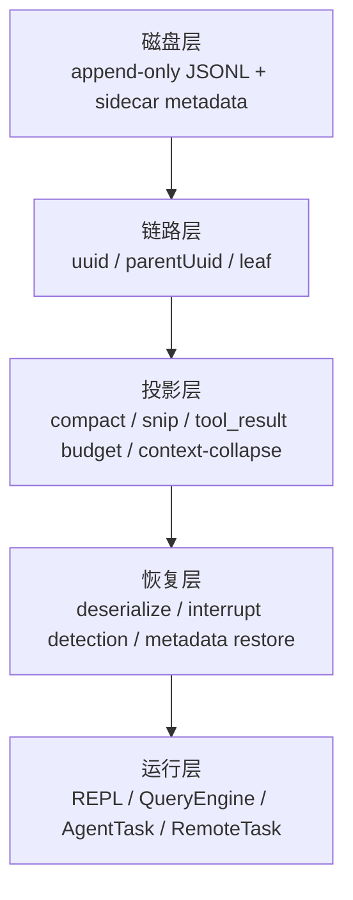
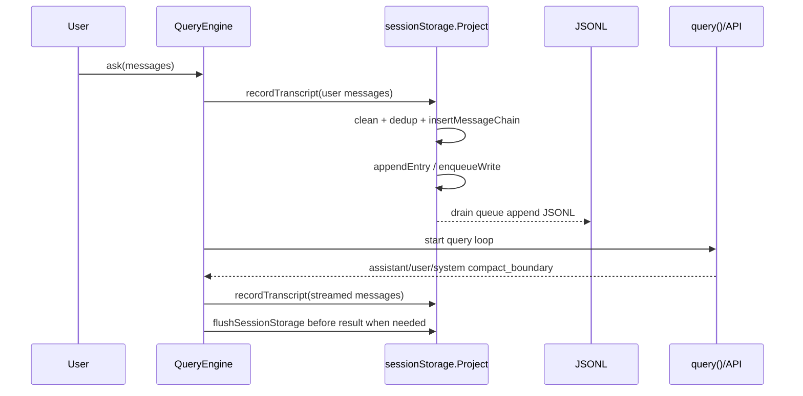
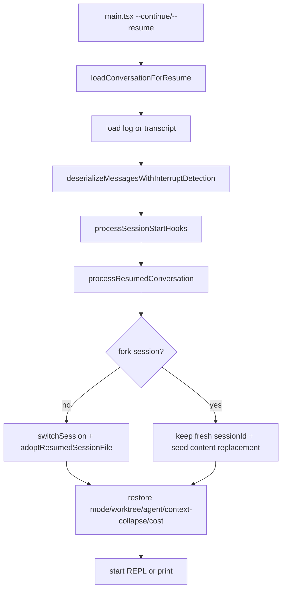
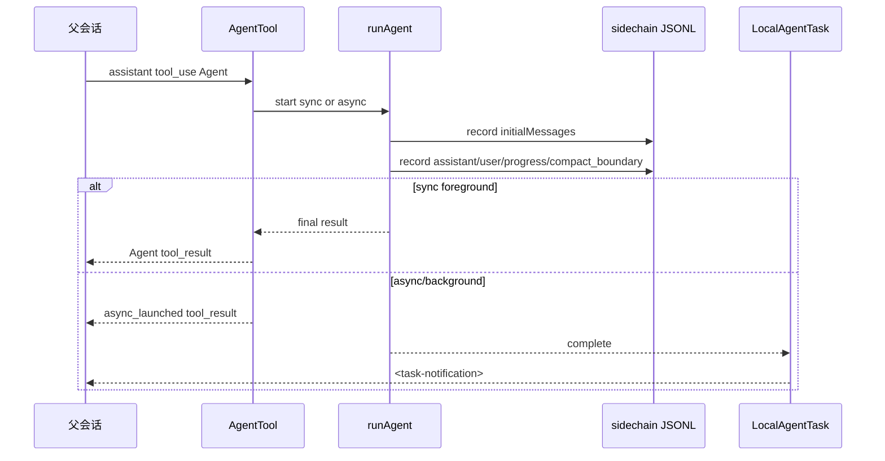
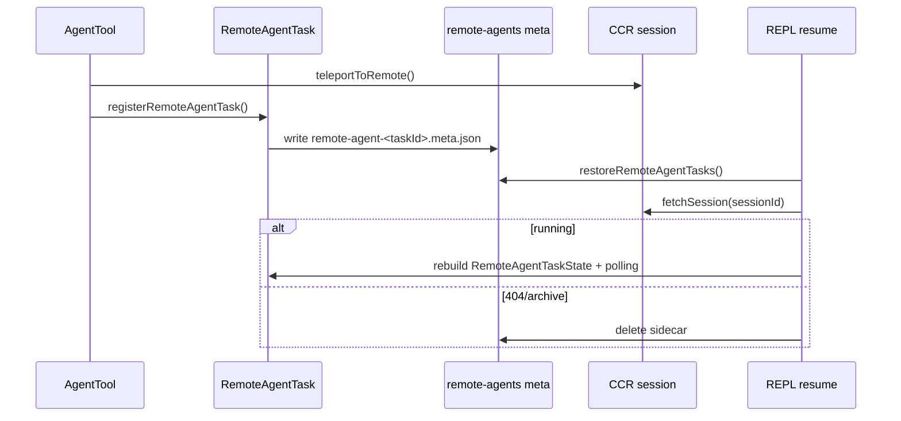

# JSONL Transcript 会话持久化与恢复机制

本文梳理 Claude Code 基于 JSONL transcript 的会话持久化、恢复、错误恢复、上下文压缩、分支、subagent、fork agent 和 remote agent 逻辑。

这不是按文件罗列的源码笔记，而是一份机制手册：先建立心智模型，再看数据结构、生命周期、异常路径和源码入口。

## 怎么读

| 如果你想看 | 建议先读 |
|---|---|
| 为什么 resume 能恢复到正确位置 | `总览`、`读取与链路重建`、`恢复入口` |
| 为什么 compact 后历史还在但模型看不到 | `上下文视图`、`Compact 与投影` |
| 为什么 subagent 不污染主会话 | `存储拓扑`、`Subagent 与 Fork Agent` |
| `/branch`、`--fork-session`、`/fork` 有什么区别 | `分支与 Fork 对比` |
| 崩溃、超限、取消后如何恢复 | `错误恢复矩阵` |

## 总览

Claude Code 的本地会话核心是 append-only JSONL。每一行是一个 `Entry`，但恢复时不会按文件顺序重放整个文件，而是：

1. 把 transcript message 放入 `uuid -> message` map。
2. 把 metadata entry 放入各自 map 或数组。
3. 选择最新 leaf。
4. 从 leaf 沿 `parentUuid` 回溯，得到当前有效链。
5. 应用 compact、snip、preserved segment、content replacement 等投影。
6. 恢复 sessionId、worktree、mode、agent setting、任务状态等内存状态。

核心不变量：

| 不变量 | 含义 |
|---|---|
| JSONL 尽量 append-only | compact、branch、sidechain 都优先追加新 entry，不直接改旧历史。 |
| `uuid/parentUuid` 决定世界线 | 文件顺序只说明写入顺序，真正恢复靠链路回溯。 |
| metadata 不参与主链 | title、tag、worktree、content replacement 等通过 sessionId/messageId/agentId 合并。 |
| compact 不删除历史 | 它追加 boundary，模型视图从最后一个 boundary 后开始。 |
| subagent 是 sidechain | 子 agent 的完整对话在独立 JSONL，父会话只看到 Agent tool 的结果/通知。 |
| remote agent 不是 sidechain | remote agent 本地只保存 sidecar 身份，执行状态来自 CCR。 |

### 系统分层



### 存储拓扑

```text
~/.claude/projects/<project-key>/
  <sessionId>.jsonl
  <sessionId>/
    subagents/
      agent-<agentId>.jsonl
      agent-<agentId>.meta.json
      <subdir>/
        agent-<agentId>.jsonl
        agent-<agentId>.meta.json
    remote-agents/
      remote-agent-<taskId>.meta.json
```

| 文件 | 生成函数 | 用途 |
|---|---|---|
| `<sessionId>.jsonl` | `getTranscriptPath()` | 主会话 transcript。 |
| `subagents/agent-<agentId>.jsonl` | `getAgentTranscriptPath(agentId)` | 本地 subagent / fork agent sidechain。 |
| `subagents/agent-<agentId>.meta.json` | `getAgentMetadataPath(agentId)` | agentType、worktreePath、description。 |
| `remote-agents/remote-agent-<taskId>.meta.json` | `getRemoteAgentMetadataPath(taskId)` | remote CCR session 身份，用于恢复 polling。 |

## 核心源码地图

| 机制 | 主要文件 |
|---|---|
| Entry 类型 | `src/types/logs.ts` |
| 路径、写入、读取、链路重建 | `src/utils/sessionStorage.ts` |
| 大文件流式读取 | `src/utils/sessionStoragePortable.ts` |
| CLI resume 加载和中断检测 | `src/utils/conversationRecovery.ts` |
| session 切换和状态恢复 | `src/utils/sessionRestore.ts` |
| SDK/headless query 写 transcript | `src/QueryEngine.ts` |
| API query loop、compact、错误恢复 | `src/query.ts` |
| compact 实现 | `src/services/compact/*` |
| context-collapse stub 与持久化接口 | `src/services/contextCollapse/*` |
| `/branch` | `src/commands/branch/branch.ts` |
| `/fork` | `src/commands/fork/fork.tsx` |
| AgentTool 和 subagent | `packages/builtin-tools/src/tools/AgentTool/*` |
| 通用 forked side query | `src/utils/forkedAgent.ts` |
| remote agent task | `src/tasks/RemoteAgentTask/RemoteAgentTask.tsx` |

## 数据模型

`Entry` 定义在 `src/types/logs.ts`，可以分为三大类。

| 类别 | 典型 type | 是否进入 `parentUuid` 链 | key | 恢复用途 |
|---|---|---:|---|---|
| transcript message | `user`、`assistant`、`attachment`、`system` | 是 | `uuid` | 重建对话链、模型上下文、UI scrollback。 |
| session metadata | `custom-title`、`tag`、`mode`、`worktree-state`、`pr-link`、`agent-setting` | 否 | `sessionId` | 恢复标题、标签、模式、worktree、PR、agent 设置。 |
| message metadata | `file-history-snapshot`、`attribution-snapshot`、`summary` | 否 | `messageId` 或 `leafUuid` | 恢复文件历史、归因、摘要。 |
| replacement metadata | `content-replacement` | 否 | `sessionId` + optional `agentId` | 恢复大 tool_result 的替换决策。 |
| context-collapse metadata | `marble-origami-commit`、`marble-origami-snapshot` | 否 | `sessionId` | 预留 context-collapse 恢复接口；当前实现为 stub。 |
| queue/task metadata | `queue-operation`、`task-summary`、`speculation-accept` | 否 | 各自字段 | 恢复队列、任务摘要、推测接受统计。 |

### TranscriptMessage 字段

真正参与链路的是 `TranscriptMessage`：

| 字段 | 含义 |
|---|---|
| `uuid` | 当前消息 ID。 |
| `parentUuid` | 链路父节点，恢复时沿它回溯。 |
| `logicalParentUuid` | compact boundary 等断链场景保留逻辑父节点。 |
| `sessionId` | 所属主 session。 |
| `cwd` | 写入时工作目录。 |
| `timestamp` | 写入时间。 |
| `version` | CLI 版本。 |
| `gitBranch` | 写入时 git 分支。 |
| `isSidechain` | 是否是 subagent sidechain。 |
| `agentId` | sidechain 所属 agent。 |
| `teamName/agentName/agentColor` | swarm / teammate 展示元数据。 |

### JSONL 示例

主会话消息：

```jsonl
{"type":"user","uuid":"u1","parentUuid":null,"sessionId":"s1","isSidechain":false,"cwd":"D:\\vibe\\claude-code","message":{"role":"user","content":"修复测试"}}
{"type":"assistant","uuid":"a1","parentUuid":"u1","sessionId":"s1","isSidechain":false,"message":{"role":"assistant","content":[{"type":"text","text":"我来检查。"}]}}
```

sidechain 消息：

```jsonl
{"type":"user","uuid":"u2","parentUuid":null,"sessionId":"s1","isSidechain":true,"agentId":"ag1","message":{"role":"user","content":"分析 compact 路径"}}
```

agent 的 `content-replacement`：

```jsonl
{"type":"content-replacement","sessionId":"s1","agentId":"ag1","replacements":[{"messageUuid":"u2","toolUseId":"toolu_...","blockIndex":0,"kind":"persisted"}]}
```

compact boundary：

```jsonl
{"type":"system","subtype":"compact_boundary","uuid":"b1","parentUuid":"a9","logicalParentUuid":"a9","sessionId":"s1","compactMetadata":{"trigger":"auto","preTokens":182000,"messagesSummarized":94}}
```

## 写入生命周期

### 总流程



关键点：

| 设计 | 为什么 |
|---|---|
| 用户输入先写 transcript，再进 API | 进程在 API 前崩溃时，resume 仍能看到用户 prompt。 |
| assistant streaming 写入多为 fire-and-forget | 不阻塞 token streaming。 |
| result 前按需 flush | 避免 SDK/桌面端拿到 result 后立即杀进程导致尾部丢失。 |
| `progress` 不参与链路 | 高频 progress tick 不应该制造分叉或膨胀 transcript。 |

### 主会话写入

入口：`recordTranscript(messages, teamInfo?, startingParentUuidHint?, allMessages?)`。

流程：

1. `cleanMessagesForLogging()` 过滤 UI-only 或不应持久化的消息。
2. `getSessionMessages(sessionId)` 读取当前 session 已有 UUID set。
3. 对未写过的消息调用 `insertMessageChain()`。
4. `insertMessageChain()` 补 `parentUuid/sessionId/cwd/timestamp/version/gitBranch/isSidechain`。
5. `appendEntry()` 进入 per-file queue。

去重不是简单丢弃所有重复：如果 prefix 中某些消息已写过，写入器会推进 `startingParentUuid`，确保后续新消息接在正确父节点后。

### 写队列、materialize 和 flush

`Project` 内部维护 per-file queue：

| 机制 | 细节 |
|---|---|
| `writeQueues` | `Map<filePath, entry[]>`，按文件聚合写入。 |
| drain timer | 默认 100ms；CCR/remote persistence 场景约 10ms。 |
| queue 上限 | 单队列超过 1000 条会丢弃最老 queued entry 并 resolve，防止内存无限增长。 |
| chunk 上限 | 单次 JSONL append chunk 约 100MB。 |
| `flushSessionStorage()` | 取消 timer，等待 active drain 和 tracked writes。 |

`sessionFile` 初始为 `null`。这时 title、tag、mode、worktree 等 metadata 先存在内存或 `pendingEntries` 中。第一次出现 `user` 或 `assistant` 时，`materializeSessionFile()` 才创建 session 文件，然后：

1. 写入缓存 metadata。
2. 回放 pending entries。
3. 之后所有 entry 正常 append。

这样可以避免“只打开 CLI 没说话”也产生 metadata-only session，污染 `/resume` 列表。

### sidechain 写入

subagent 使用 `recordSidechainTranscript(messages, agentId, startingParentUuid?)`。

它底层仍走 `insertMessageChain()`，但写入字段不同：

```ts
isSidechain: true
agentId: agentId
```

`appendEntry()` 遇到 `isSidechain && agentId` 的 transcript message，会把它路由到：

```text
<project>/<sessionId>/subagents/agent-<agentId>.jsonl
```

如果 `content-replacement` 带 `agentId`，也会路由到该 agent 的 sidechain JSONL，而不是主 session JSONL。

一个很重要的例外：sidechain 写入不会用主 session UUID set 做去重。fork agent 会复用父会话消息 UUID 来继承上下文；如果按主 session 去重，会把继承上下文从 sidechain 中误删，导致 agent resume 时只剩子 prompt。

## 读取与链路重建

### 从 JSONL 到有效链

```mermaid
flowchart TD
  A[loadTranscriptFile(file)] --> B[readTranscriptForLoad<br/>大文件按 chunk 读]
  B --> C[parseJSONL Entry]
  C --> D[messages Map uuid->TranscriptMessage]
  C --> E[metadata maps/arrays]
  D --> F[progress bridge / preserved relink / snip removal]
  F --> G[select leaf]
  G --> H[buildConversationChain]
  H --> I[recoverOrphanedParallelToolResults]
  I --> J[LogOption or agent transcript]
```

`loadTranscriptFile(filePath, opts?)` 产出：

| 输出 | 用途 |
|---|---|
| `messages` | `uuid -> TranscriptMessage`。 |
| `leafUuids` | 候选 leaf。 |
| title/tag/mode/worktree/PR maps | session metadata。 |
| `fileHistorySnapshots` / `attributionSnapshots` | 文件状态恢复。 |
| `contentReplacements` | 主线程 replacement records。 |
| `agentContentReplacements` | `agentId -> replacement records`。 |
| `contextCollapseCommits` / `contextCollapseSnapshot` | context-collapse 恢复输入。 |

### leaf 与 parent 链

`buildConversationChain(messages, leaf)`：

1. 从 leaf 开始。
2. 读取 `parentUuid`。
3. 找到父消息并继续回溯。
4. 检测 parent cycle，避免无限循环。
5. reverse 成正序 transcript。
6. 补回并行 tool_use 形成的 DAG 分支。

一个简化例子：

```text
u1 <- a1 <- u2 <- a2
                 ^
               leaf

恢复链: a2 -> u2 -> a1 -> u1
正序链: u1, a1, u2, a2
```

文件顺序不等于有效链。branch、rewind、streaming fallback 都可能让 JSONL 里有死分支；恢复只选择当前 leaf 所在世界线。

### metadata 合并规则

| metadata | 合并方式 | 说明 |
|---|---|---|
| `custom-title`、`tag`、`mode`、`worktree-state`、`pr-link`、`agent-setting` | sessionId keyed，通常 last-wins | 恢复最新 session 状态。 |
| `file-history-snapshot`、`attribution-snapshot` | messageId keyed / array | 恢复文件历史与归因。 |
| `content-replacement` | append array | 多轮 replacement 决策都要保留。 |
| `agentContentReplacements` | agentId keyed + append array | agent resume 重建 sidechain replacement state。 |
| `marble-origami-commit` | ordered array | 顺序有语义，后一个 commit 可能引用前一个 summary。 |
| `marble-origami-snapshot` | last-wins | staged snapshot 只恢复最新状态。 |

### 大文件读取优化

transcript 可增长到几百 MB 甚至 GB，读取路径有几层防护。

| 优化 | 位置 | 目的 |
|---|---|---|
| chunk 读取 | `readTranscriptForLoad()` | 避免一次性读爆内存。 |
| fd 层跳过大 metadata | `readTranscriptForLoad()` | `attribution-snapshot` 等大 entry 不进入 buffer。 |
| compact 前缀跳过 | `readTranscriptForLoad()` | 遇到非 preserved compact boundary 后，只保留 boundary 后内容。 |
| pre-boundary metadata scan | `scanPreBoundaryMetadata()` | compact 前被跳过时，仍保留 title/tag/mode/worktree/PR 等展示信息。 |
| byte-level dead branch 裁剪 | `walkChainBeforeParse()` | JSON.parse 前只拼 active chain 和 metadata，跳过 dead fork/rewind branch。 |
| lite read 限制 | `MAX_TRANSCRIPT_READ_BYTES` | 直接读 raw transcript 的调用超过约 50MB 要避开。 |

`walkChainBeforeParse()` 只有预计能丢掉至少一半 buffer 时才做 concat，避免优化本身变成额外成本。

### preserved segment 与 snip

compact boundary 可以带 `compactMetadata.preservedSegment`。恢复时 `applyPreservedSegmentRelinks()` 会：

1. 验证 `tailUuid -> headUuid` 链是否完整。
2. 把 preserved segment 的 head 接到 compact anchor 后。
3. 把 anchor 的其他 children 接到 preserved tail。
4. 删除最后一个 boundary 前且不属于 preserved segment 的旧消息。
5. 清零 preserved assistant 的 usage，避免恢复后马上又触发 autocompact。

示意：

```text
compact 前: old... -> anchor -> head -> ... -> tail -> next
compact 后: boundary/summary -> head -> ... -> tail -> next
```

`snip` 和 compact 不同：compact 截断前缀，snip 删除中段。JSONL 不能真的删除旧行，所以 `applySnipRemovals()` 在内存 map 中删除 `removedUuids`，再把 dangling `parentUuid` 重连到最近未删除祖先。

### 旧链路修复

| 问题 | 修复 |
|---|---|
| legacy `progress` 曾进入 parent 链 | `progressBridge` 把指向 progress 的 parent 改回 progress 的真实父节点。 |
| parent cycle | `buildConversationChain()` 检测 cycle，记录并返回 partial chain。 |
| 并行 tool_use 形成 DAG | `recoverOrphanedParallelToolResults()` 按 assistant `message.id` 和 tool_result parent 关系补回 sibling。 |
| streaming fallback 孤儿尾巴 | tombstone 触发 `removeTranscriptMessage(uuid)` 删除失败 attempt。 |

## 恢复入口

### 入口矩阵

| 入口 | 加载源 | 是否复用原 sessionId | 是否 adopt 原 JSONL | 特点 |
|---|---|---:|---:|---|
| `--continue` | 当前目录最近 session | 是 | 是 | 跳过仍 live 的 bg/daemon 非 interactive session。 |
| `--resume <uuid>` | 指定 session | 是 | 是 | 也支持 custom title / 搜索词 / picker。 |
| `--resume <jsonl>` | 指定 JSONL 文件 | 是 | 是 | Ant 内部/print path 支持。 |
| `--fork-session` + resume | 旧 session messages | 否 | 否 | 保持新 sessionId，把旧消息作为新 session 初始内容。 |
| `--resume-session-at <message.id>` | print/headless resume | 取决于 resume | 取决于 resume | 截断到指定 assistant message。 |
| REPL `/resume` | picker / log option | 是或 fork | 是或否 | 会跑 SessionEnd/SessionStart hooks，切换 UI state。 |

### CLI resume 流程



核心函数：

| 函数 | 责任 |
|---|---|
| `loadConversationForResume()` | 统一加载最近 session、sessionId、LogOption 或 JSONL path；补 lite log；复制 plan/file history；做 consistency check；反序列化和中断检测；返回 metadata。 |
| `processResumedConversation()` | CLI interactive 启动恢复；切换或 fork session；恢复 cost、worktree、mode、agent setting、context-collapse、attribution。 |
| `restoreSessionStateFromLog()` | 恢复 AppState 侧状态：file history、attribution、context-collapse、TodoWrite todos。 |

### REPL `/resume`

REPL 内 resume 比 CLI 启动路径多了“从当前 session 切换到另一个 session”的工作：

1. 清理目标 log messages。
2. 当前 session 跑 SessionEnd hooks。
3. 目标 session 跑 SessionStart resume hooks。
4. 保存当前 session cost，恢复目标 session cost。
5. `switchSession(sessionId, dirname(fullPath))` 原子切换 sessionId + project dir。
6. `resetSessionFilePointer()` 并恢复 metadata cache。
7. 非 fork 时退出上一次 worktree，恢复目标 worktree，`adoptResumedSessionFile()`。
8. fork 时不接管原 transcript，不退出当前 worktree。
9. 重建 content replacement state。
10. 恢复 remote/local task 状态。
11. 替换 messages、清 tool JSX、清输入框。

### 中断检测矩阵

`deserializeMessagesWithInterruptDetection()` 会先清理历史消息：

| 清理 | 目的 |
|---|---|
| legacy attachment 迁移 | 兼容旧 transcript。 |
| 非法 `permissionMode` 删除 | 防止跨 build 的无效枚举进入运行态。 |
| unresolved tool_use 过滤 | 避免 API 报 tool_use/tool_result 不配对。 |
| orphaned thinking-only assistant 过滤 | 避免中断 streaming 留下孤儿 thinking block。 |
| whitespace-only assistant 过滤 | 避免取消时留下空白 assistant。 |

然后看最后一个 turn-relevant message：

| 最后有效消息 | 结果 | 额外动作 |
|---|---|---|
| assistant | `none` | streaming 持久化里 stop_reason 常为 null，不能靠它判断未完成。 |
| 普通 user | `interrupted_prompt` | 插入 `NO_RESPONSE_REQUESTED` sentinel 保持 API-valid。 |
| meta user / compact summary user | `none` | 不把内部控制消息当用户新请求。 |
| tool_result user | 通常 `interrupted_turn` | 例外：Brief/SendUserMessage/SendUserFile terminal tool_result 视为完成。 |
| attachment | `interrupted_turn` | 追加 meta user：`Continue from where you left off.` |
| system/progress/API error assistant | 跳过 | 不作为 turn 完成判断依据。 |

`interrupted_turn` 会统一转换为 `interrupted_prompt`，让上层只处理一种“需要续跑”的状态。

## 错误恢复矩阵

| 场景 | 处理策略 | transcript 影响 |
|---|---|---|
| API 前进程崩溃 | 用户 prompt 已由 `QueryEngine.ask()` 先写入。 | resume 看到普通 user，触发 `interrupted_prompt`。 |
| streaming fallback 产生孤儿 assistant | yield tombstone，REPL 移除 UI message 并调用 `removeTranscriptMessage(uuid)`。 | 优先只改 JSONL 尾部 64KB；大文件目标不在尾部时跳过慢 rewrite。 |
| prompt-too-long / media-too-large | streaming 阶段先 withheld；先 context-collapse drain，再 reactive compact；失败才暴露错误。 | compact 成功则写 boundary/summary 并重试；失败才写 API error message。 |
| max_output_tokens | 先提高 max output override；仍失败则注入内部 recovery prompt 续写；耗尽才暴露错误。 | 内部 retry prompt 不一定成为普通 transcript，取决于是否 yield 到外层。 |
| auto compact 关闭但到 blocking limit | 直接 yield prompt-too-long 风格 API error。 | 保留用户手动 `/compact` 空间。 |
| abort during streaming/tools | 补齐缺失 tool_result，必要时 yield user interruption message。 | `reason === interrupt` 时跳过 interruption message，因为后续 queued user message 已提供上下文。 |
| stop hook blocking | 把 hook blocking error 加入 state 后重试。 | 有 reactive compact guard，避免 hook/error/compact 无限循环。 |
| compact boundary 指向未落盘 tail | QueryEngine 写 boundary 前强制补写 preserved tail 前的消息。 | 避免恢复时 boundary 引用不存在 UUID。 |
| subagent transcript 尾部不完整 | `resumeAgentBackground()` 再次过滤 unresolved tool_use、orphan thinking、空白 assistant。 | 避免恢复 agent 后 API 请求非法。 |

## 上下文视图

同一份消息在系统里有四种视图，不要混在一起：

| 视图 | 内容 | 谁使用 |
|---|---|---|
| Raw transcript | JSONL 中所有 entry，包括旧历史、dead branch、metadata、sidechain。 | 磁盘持久化和审计。 |
| UI scrollback | REPL 当前展示的消息，可能保留 compact 前历史和 collapsed UI group。 | 终端 UI。 |
| Active query view | `getMessagesAfterCompactBoundary()` 后的消息，默认再投影 snip。 | `query.ts` 上下文管理。 |
| API wire view | `normalizeMessagesForAPI()` 后，过滤 system boundary、修复 tool pairing、插入 cache edits。 | Anthropic/OpenAI/Gemini 等 API client。 |

每轮 query 的 active context 顺序：

1. `getMessagesAfterCompactBoundary(messages)`：取最近 compact boundary 之后的 active slice，默认叠加 snip 投影。
2. 删除旧 `toolUseResult` 原始 payload，只保留 API 需要的 `message.content`。
3. `applyToolResultBudget()`：过大的 tool_result 替换为 preview/stub，并写 `content-replacement`。
4. `snipCompactIfNeeded()`：`HISTORY_SNIP` 下删除中段历史。
5. `microcompactMessages()`：time-based microcompact，再 cached microcompact。
6. `contextCollapse.applyCollapsesIfNeeded()`：当前为 identity stub。
7. `autoCompactIfNeeded()`：主动 compact，优先 session memory compact。
8. predictive autocompact：API 前估算本 turn 增长，必要时提前 compact。
9. API 真实超限后：context-collapse drain，再 reactive compact。

## Compact 与投影

### Compact 类型对比

| 类型 | 触发 | 摘要来源 | 是否调用 compact API | 是否保留尾段 | 失败策略 |
|---|---|---|---:|---:|---|
| manual compact | `/compact` | compact summary API 或 session memory | 取决于路径 | 取决于 full/partial/SM | 显示失败或回退传统 compact。 |
| auto compact | token 阈值 | 先 session memory，后 summary API | 取决于路径 | 取决于路径 | 连续失败 circuit breaker，默认 3 次后停止自动 compact。 |
| predictive compact | API 前估算增长 | 同 auto compact | 取决于路径 | 取决于路径 | 失败则继续原请求或走后续错误恢复。 |
| reactive compact | API 真实 413/media error 后 | `compactConversation()` | 是 | 当前 wrapper 取决于 compact 实现 | `hasAttemptedReactiveCompact` 防循环。 |
| session memory compact | manual/auto 前置尝试 | session memory 文件 | 否 | 是 | 若 post-compact 仍超阈值，放弃并回退传统 compact。 |
| microcompact | time/cached 小型压缩 | 局部清理或 API cache edit | 不一定 | 不适用 | 通常不改变 JSONL 主历史。 |
| snip | `HISTORY_SNIP` | 删除中段 | 否 | 保留前后上下文 | 通过 snip metadata 投影，不物理删旧行。 |

### Compact 结果形态

传统 compact 会生成：

1. `compact_boundary` system message。
2. compact summary user message。
3. post-compact attachments，例如当前文件、计划模式、技能、MCP/tool schema delta、hook 结果。

简化 before/after：

```text
Raw/UI:
  u1, a1, u2, a2, ... u99, a99,
  system:compact_boundary,
  user:compact summary,
  attachment:current files,
  u100

Active query view:
  system:compact_boundary,
  user:compact summary,
  attachment:current files,
  u100

API wire view:
  user:compact summary,
  attachment/content,
  u100
```

boundary 本身是 system message，最后会被 API normalization 过滤；它的价值主要在本地投影、恢复和统计。

### Boundary metadata

`createCompactBoundaryMessage()` 写：

| 字段 | 含义 |
|---|---|
| `compactMetadata.trigger` | `manual` 或 `auto`。 |
| `compactMetadata.preTokens` | compact 前 token 数。 |
| `compactMetadata.userContext` | 用户手动 compact 的额外说明。 |
| `compactMetadata.messagesSummarized` | 被总结消息数量。 |
| `logicalParentUuid` | compact 前最后消息，用于逻辑追踪。 |

后续路径还会补：

| 字段 | 来源 | 作用 |
|---|---|---|
| `preCompactDiscoveredTools` | traditional/SM compact | 恢复 deferred tool schema 可见性。 |
| `preservedSegment.{headUuid,anchorUuid,tailUuid}` | partial/SM compact | 恢复时把保留尾段接到 boundary 后。 |

### Tool result budget 与 content replacement

大 tool_result 不一定直接进入后续上下文。`applyToolResultBudget()` 会按 API-level user message 聚合预算，必要时把大块内容持久化并替换成较小 preview/stub。

关键点：

| 点 | 说明 |
|---|---|
| replacement decision 会落 JSONL | `recordContentReplacement()` 写 `content-replacement`。 |
| 主线程和 agent 分开 | 无 `agentId` 写主 JSONL；有 `agentId` 写 sidechain JSONL。 |
| resume 会重建 replacement state | 避免恢复后同一大结果又变回完整内容，导致 token 暴涨或 prompt cache 失配。 |
| `--fork-session` 会 seed records | fork 新 session 时复制 replacement 决策到新 session。 |

### Session memory compact

`sessionMemoryCompact.ts` 是传统 summary compact 前的实验路径。流程：

1. 等待 session memory extraction 完成。
2. 读取 session memory 文件。
3. 有 `lastSummarizedMessageId` 时，从其后保留安全尾段；否则把 resumed session 视为已有 memory summary。
4. 调整切点，避免断开 tool_use/tool_result 或 thinking blocks。
5. 创建标准 `compact_boundary` + summary user message。
6. 若 post-compact token count 仍超过阈值，放弃并回退传统 compact。

因为产物仍是标准 `CompactionResult`，下游写 transcript 和恢复逻辑与传统 compact 共用。

### Context-collapse 当前状态

本仓库保留了 context-collapse 的持久化接口，但核心实现是 stub：

| 模块 | 当前行为 |
|---|---|
| `contextCollapse/index.ts` | `applyCollapsesIfNeeded()` 返回原 messages；`recoverFromOverflow()` 返回 committed=0；`isWithheldPromptTooLong()` 恒 false。 |
| `contextCollapse/operations.ts` | `projectView()` 是 identity。 |
| `contextCollapse/persist.ts` | `restoreFromEntries()` 是 no-op。 |

已预留 JSONL entry：

| Entry | 写入接口 | 内容 |
|---|---|---|
| `marble-origami-commit` | `recordContextCollapseCommit()` | `collapseId`、summary UUID/content、archived span 边界。 |
| `marble-origami-snapshot` | `recordContextCollapseSnapshot()` | staged spans、armed、lastSpawnTokens。 |

loader 会收集这些 entry；遇到 compact boundary 时会清空旧 commits/snapshot，避免它们引用已被 compact 丢弃的 UUID。

所以当前真实生效的上下文缩减主要是 compact、session memory compact、tool_result budget、microcompact 和 snip；context-collapse 只是接口已接好。

### Compact 后清理

`runPostCompactCleanup(querySource)` 总是清：

- microcompact state。
- system prompt sections。
- classifier approvals。
- speculative bash checks。
- beta tracing。
- session messages memo cache。
- compact cleanup callbacks。
- `COMMIT_ATTRIBUTION` 下异步 sweep file-content cache。

只在主线程 compact 清：

- context-collapse store。
- `getUserContext` cache。
- memory files cache。

原因：subagent 和主线程同进程，共享模块级状态。`agent:*` compact 如果清主线程 context-collapse 或 memory cache，会破坏父会话状态。

它明确不清 `resetSentSkillNames()`，避免 compact 后重新注入完整 skill listing，浪费 token 和 prompt cache。

## 分支与 Fork 对比

| 入口 | 本质 | 是否新主 session | 是否 subagent | 持久化位置 | 父会话看到什么 | 恢复方式 |
|---|---|---:|---:|---|---|---|
| `/branch` | 复制当前主 transcript 成新 JSONL | 是 | 否 | `<newSessionId>.jsonl` | 直接切到新分支会话 | 普通 session resume。 |
| `--fork-session` | resume/continue 时把旧消息作为新 session 初始消息 | 是 | 否 | 新 session 首次写入时 materialize | 启动即在新 session 中继续 | 新 session resume。 |
| `/fork <directive>` | slash wrapper，调用 AgentTool fork | 否 | 是 | `subagents/agent-<id>.jsonl` + `.meta.json` | fork started + task notification | `resumeAgentBackground()`。 |
| `AgentTool({ fork: true })` | Tool 层 fork 子 agent | 否 | 是 | `subagents/agent-<id>.jsonl` + `.meta.json` | sync final tool_result 或 async notification | `resumeAgentBackground()`。 |
| 普通 AgentTool async | 后台本地 subagent | 否 | 是 | `subagents/agent-<id>.jsonl` + `.meta.json` | `async_launched` + task notification | `resumeAgentBackground()`。 |
| remote AgentTool | CCR remote session | 否 | 远端 | `remote-agents/*.meta.json` | remote task output/notification | `restoreRemoteAgentTasks()` + CCR。 |

### `/branch`

`/branch` 创建新 session 文件，不是在原 JSONL 里追加 branch marker。

流程：

1. 生成新的 sessionId。
2. 读取当前 transcript 文件。
3. 过滤主会话消息，排除 `isSidechain` 和非 transcript entry。
4. 复制消息并重写 `sessionId`。
5. 重新串 `parentUuid`。
6. 添加 `forkedFrom: { sessionId, messageUuid }`。
7. 复制原 session 的 `content-replacement` entry 并改成新 sessionId。
8. 写入 `<newSessionId>.jsonl`。
9. 构造 `LogOption` 并让 REPL resume 到新分支。

### `--fork-session`

`--fork-session` 只改变 resume 的 ownership：

| 非 fork resume | fork-session resume |
|---|---|
| 切到旧 sessionId。 | 保持启动时 fresh sessionId。 |
| `adoptResumedSessionFile()` 接管旧 JSONL。 | 不接管旧 JSONL。 |
| 后续继续 append 到旧 transcript。 | 后续 materialize 成新 transcript。 |
| 原 session 继续增长。 | 原 session 不被写入。 |

如果旧 session 有 `content-replacement`，会先把 records seed 到新 session，避免大 tool_result 的替换状态丢失。

## Subagent 与 Fork Agent

### 普通 subagent

普通 AgentTool subagent 最终走 `runAgent()`：



父会话通常只记录：

- Agent tool_use。
- Agent tool_result。
- async launch result。
- task notification。
- 必要 progress。

完整子 agent 内部工具调用和消息在 sidechain JSONL 中，不会混进主会话 active context。

### Fork agent

fork agent 是 AgentTool 的一种特殊 subagent。它继承父上下文、system prompt、tools、model 和 thinking config，目标是让多个子 agent 共享尽可能长的 byte-identical prompt cache prefix。

关键实现：

| 继承内容 | 实现 |
|---|---|
| system prompt | 优先使用 `toolUseContext.renderedSystemPrompt`，没有才 fallback 重建。 |
| tools | 使用父 `toolUseContext.options.tools`，`useExactTools: true`。 |
| model | `FORK_AGENT.model = "inherit"`。 |
| thinking/non-interactive | 通过 exact tool/options 继承，避免 cache key 分叉。 |
| messages | `forkContextMessages = toolUseContext.messages`。 |

`buildForkedMessages()` 负责构造 cache-friendly 尾部：

```text
parent history...
assistant: [text/thinking/tool_use A/tool_use B/...]
user:
  tool_result for A = "Fork started — processing in background"
  tool_result for B = "Fork started — processing in background"
  directive = "<this fork's task>"
```

多个 fork child 的长前缀相同，只有最后 directive 不同。

限制：

| 限制 | 原因 |
|---|---|
| 需要 `FORK_SUBAGENT` feature。 | 功能门控。 |
| coordinator mode 禁用。 | coordinator 已有自己的编排模型。 |
| non-interactive session 禁用。 | fork subagent 偏交互式后台任务模型。 |
| fork child 禁止递归 fork。 | 防止无限 fork；通过 querySource 和 boilerplate tag 检测。 |
| resume fork agent 不再传 `forkContextMessages`。 | sidechain 已包含父上下文切片，重复传会造成重复 tool_use id。 |

### `runForkedAgent()` 不是 AgentTool fork

`src/utils/forkedAgent.ts` 的 `runForkedAgent()` 是内部 cache-safe side query 工具，用于 session memory、prompt suggestion、summary 等。它复用父 system/user/system context、tools、messages，可选 `skipTranscript`，但默认不写 AgentTool metadata，也不是用户可继续对话的 AgentTool fork。

## Agent 恢复

本地 agent 恢复入口是 `resumeAgentBackground()`。

流程：

```mermaid
flowchart TD
  A[user continues agent] --> B[getAgentTranscript(agentId)]
  B --> C[load sidechain JSONL + build chain]
  C --> D[readAgentMetadata(agentId)]
  D --> E[filter unresolved tool_use/thinking/blank assistant]
  E --> F[reconstruct content replacement state]
  F --> G{metadata.worktreePath exists?}
  G -- yes --> H[runWithCwdOverride(worktreePath)]
  G -- no --> I[parent cwd]
  H --> J[register async LocalAgentTask]
  I --> J
  J --> K[continue query loop]
```

恢复时：

| 状态 | 来源 |
|---|---|
| agent transcript | `agent-<agentId>.jsonl`。 |
| agent type | `agent-<agentId>.meta.json`。 |
| fork/general agent 选择 | metadata `agentType`。 |
| worktree cwd | metadata `worktreePath`，目录不存在则回退父 cwd。 |
| content replacement | sidechain records + parent live state gap-fill。 |
| task UI | 重新注册 async task。 |

## Remote Agent 恢复

remote CCR agent 不靠本地 sidechain 继续执行。



差异：

| 本地 subagent | remote agent |
|---|---|
| 有完整 sidechain JSONL。 | 没有本地执行 transcript。 |
| resume 可继续 API 对话。 | resume 只恢复 polling。 |
| 状态来自 JSONL + `.meta.json`。 | 状态来自 CCR session + local sidecar。 |
| 完成后本地 sidechain 仍可审计。 | 完成/archived 后 sidecar 会删除。 |

## 常见误区

| 误区 | 正确理解 |
|---|---|
| JSONL 顺序就是会话顺序 | 恢复靠 leaf + `parentUuid`，不是简单顺序 replay。 |
| compact 删除了旧历史 | compact 追加 boundary；旧历史仍在 raw transcript。 |
| boundary 会发给模型 | boundary 是本地 system marker，API normalization 会过滤。 |
| `/branch` 和 `/fork` 都是 fork | `/branch` 是新主 session；`/fork` 是 fork subagent sidechain。 |
| `--fork-session` 等于 `/branch` | 它不是复制文件命令，而是 resume 时保持 fresh session ownership。 |
| subagent 消息会进入主上下文 | 父会话只看到 Agent tool result/notification，完整内部消息在 sidechain。 |
| remote agent 有本地 sidechain | remote 只有 sidecar 身份，执行状态来自 CCR。 |
| context-collapse 已经真实压缩上下文 | 当前仓库中 context-collapse 核心实现是 stub。 |

## 源码入口索引

| 问题 | 从这里看 |
|---|---|
| Entry union 有哪些类型 | `src/types/logs.ts` 的 `Entry`。 |
| 主 transcript 路径 | `src/utils/sessionStorage.ts` 的 `getTranscriptPath()`。 |
| subagent transcript 路径 | `getAgentTranscriptPath(agentId)`。 |
| remote sidecar 路径 | `getRemoteAgentsDir()` / `getRemoteAgentMetadataPath()`。 |
| 主写入 | `recordTranscript()`。 |
| sidechain 写入 | `recordSidechainTranscript()`。 |
| write queue | `Project.enqueueWrite()` / `drainWriteQueue()` / `flush()`。 |
| lazy materialize | `Project.materializeSessionFile()`。 |
| tombstone 删除 | `removeTranscriptMessage()` / `Project.removeMessageByUuid()`。 |
| 读取 transcript | `loadTranscriptFile()`。 |
| 大文件读取 | `readTranscriptForLoad()` in `sessionStoragePortable.ts`。 |
| dead branch 裁剪 | `walkChainBeforeParse()`。 |
| parent 链重建 | `buildConversationChain()`。 |
| parallel tool_result 补回 | `recoverOrphanedParallelToolResults()`。 |
| preserved segment | `applyPreservedSegmentRelinks()`。 |
| snip removal | `applySnipRemovals()`。 |
| CLI resume 加载 | `loadConversationForResume()`。 |
| resume 状态切换 | `processResumedConversation()`。 |
| AppState 恢复 | `restoreSessionStateFromLog()`。 |
| 中断检测 | `deserializeMessagesWithInterruptDetection()`。 |
| active context | `getMessagesAfterCompactBoundary()`。 |
| query context pipeline | `src/query.ts`。 |
| compact boundary | `createCompactBoundaryMessage()`。 |
| auto compact | `autoCompactIfNeeded()` / `shouldAutoCompact()`。 |
| session memory compact | `src/services/compact/sessionMemoryCompact.ts`。 |
| reactive compact | `src/services/compact/reactiveCompact.ts`。 |
| post compact cleanup | `runPostCompactCleanup()`。 |
| context-collapse stub | `src/services/contextCollapse/*`。 |
| `/branch` | `src/commands/branch/branch.ts`。 |
| `/fork` | `src/commands/fork/fork.tsx`。 |
| AgentTool fork | `AgentTool.tsx` + `forkSubagent.ts`。 |
| 普通 subagent 运行 | `runAgent.ts`。 |
| agent resume | `resumeAgent.ts`。 |
| remote task restore | `restoreRemoteAgentTasks()`。 |
